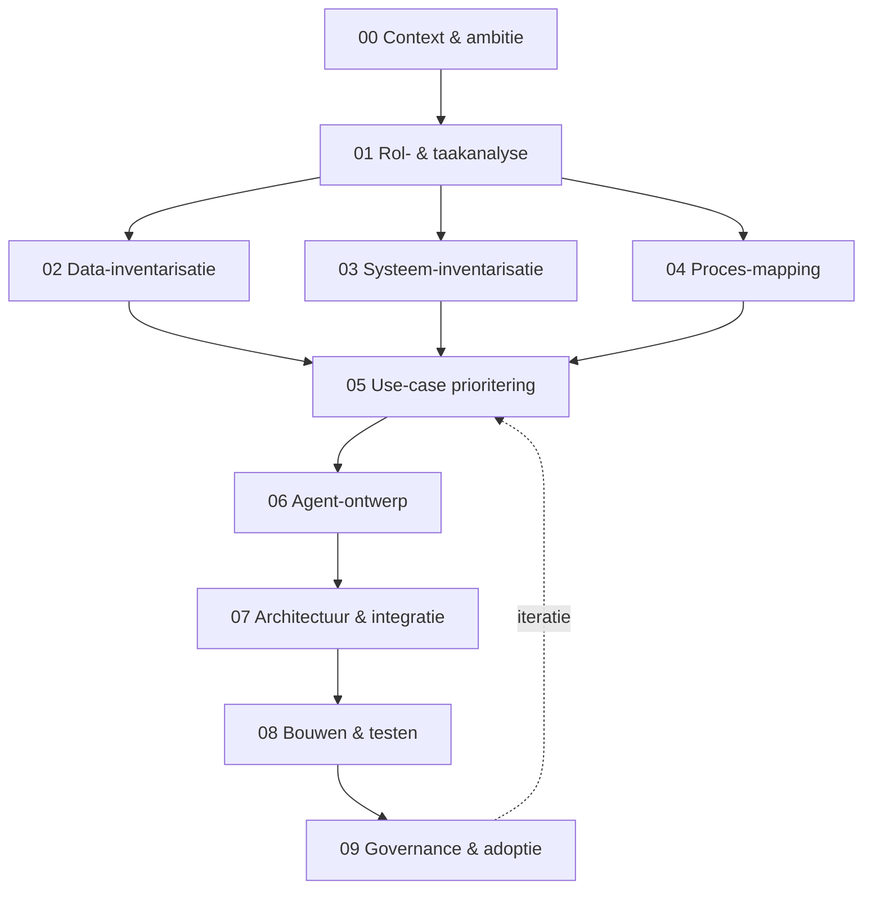

# Werkvoorbereider Agent Blueprint (bouwsector)

Een gestructureerd **stappenplan (blueprint)** waarmee bouwbedrijven — zowel
business-mensen als developers — hun eigen **werkvoorbereidingsagent** kunnen
ontwerpen en bouwen op het Microsoft-platform.

De blueprint is bewust vak-inhoudelijk: hij begint bij het werk van een
**werkvoorbereider** in de bouw en leidt je stap voor stap naar een werkende,
verantwoorde AI-agent (of een samenwerkend team van agents).

---

## Voor wie is dit?

De blueprint kent **twee sporen** die naast elkaar lopen. Stap 0 t/m 5 zijn
gedeeld; vanaf stap 6 kies je jouw spoor (of gebruik je beide):

| Spoor | Voor wie | Platform |
|---|---|---|
| **Business-spoor** | Werkvoorbereiders, projectleiders, business-analisten, low-code makers | **Microsoft Copilot Studio** + Power Platform / Dataverse |
| **Dev-spoor** | Developers, integratie- en platformteams | **Microsoft Foundry** (pro-code agents, `agent.yaml`, SDK) |

> Je hoeft geen AI-expert te zijn. Het business-spoor is low-code; het dev-spoor
> is voor teams die dieper willen integreren met bestaande systemen.

---

## Het stappenplan in één oogopslag

| Stap | Wat je doet | Resultaat |
|---|---|---|
| [00 Context & ambitie](blueprint/00-context-en-ambitie/) | Bepaal segment, volwassenheid en ambitie | Contextprofiel |
| [01 Rol- & taakanalyse](blueprint/01-rol-en-taakanalyse/) | Breng de taken van je werkvoorbereider in kaart | Taken-canvas |
| [02 Data-inventarisatie](blueprint/02-data-inventarisatie/) | Welke data, waar, welk formaat, hoe gevoelig | Data-register |
| [03 Systeem-inventarisatie](blueprint/03-systeem-inventarisatie/) | Welke systemen en hoe koppelbaar | Systeem-/integratiematrix |
| [04 Proces-mapping](blueprint/04-proces-mapping/) | Hoe loopt het werk nu; waar zit de pijn | Procesplaten + knelpunten |
| [05 Use-case prioritering](blueprint/05-usecase-prioritering/) | Kies waar je begint (waarde × haalbaarheid) | Prioriteitsmatrix |
| [06 Agent-ontwerp](blueprint/06-agent-ontwerp/) | Ontwerp instructies, kennis, tools en autonomie | Agent-spec |
| [07 Architectuur & integratie](blueprint/07-architectuur-en-integratie/) | Kies platform, koppelingen en security | Architectuurplaat |
| [08 Bouwen & testen](blueprint/08-bouwen-en-testen/) | Bouw een MVP en evalueer | Werkende agent + testset |
| [09 Governance & adoptie](blueprint/09-governance-en-adoptie/) | Verantwoord uitrollen en meten | Governance- & adoptieplan |

---

## Hoe gebruik je deze blueprint?

1. **Lees eerst de domein-analyse.** Begrijp wat een werkvoorbereider doet:
   zie [blueprint/README.md](blueprint/README.md) en
   [00 Context & ambitie](blueprint/00-context-en-ambitie/).
2. **Doorloop de stappen op volgorde.** Elke stap heeft:
   - een hoofdstuk (`README.md`) met *doel · invulvragen · voorbeeld · valkuilen*;
   - een invulbare **template** (`template.md`) die je kopieert en invult.
3. **Volg de rode draad.** In [referentie/](referentie/) vind je een volledig
   uitgewerkt voorbeeld: een **werkvoorbereidingsagent** (Project Coach met
   **6 kern-sub-agents + Mensen-service**) — de kennis-agents
   ([Bestek](referentie/usecase-bestek/), [Compliance](referentie/usecase-compliance/),
   [Meer-/minderwerk](referentie/usecase-meerminderwerk/)) en de actie-agents
   ([Inkoop & Materialen](referentie/usecase-inkoop-materialen/),
   [Planning & Capaciteit](referentie/usecase-planning/),
   [Oplever](referentie/usecase-oplever/), [Mensen-service](referentie/usecase-mensen/)).
4. **Gebruik de interactieve tool.** Open [tool/index.html](tool/index.html) in
   je browser: een begeleide **bouwgids** met rolbadges (business ↔ IT),
   checklists, praktische tips en een ROCKET prompt-starter — vul de 9 stappen in
   en exporteer je blueprint (Markdown of JSON).

---

## Structuur van deze repo

| Map | Inhoud |
|---|---|
| [blueprint/](blueprint/) | De 9 stappen: per stap een hoofdstuk + invulbare template |
| [referentie/](referentie/) | Uitgewerkt voorbeeld: multi-agent architectuur + diepe use-case |
| [voorbeelddata/](voorbeelddata/) | Fictief mini-bouwproject als oefenmateriaal |
| [tool/](tool/) | Interactieve HTML-**bouwgids** (guideline + checklist + tips) om de blueprint in te vullen |

---

## Uitgangspunten

- **Taal:** Nederlands (aansluitend op de Nederlandse bouwsector).
- **Platform:** Microsoft (Copilot Studio + Foundry). De *methodiek* (stap 0–5)
  is platform-onafhankelijk; de *bouwstappen* (6–8) zijn Microsoft-specifiek.
- **Verantwoorde AI:** de blueprint stuurt op bronvermelding, menselijke controle
  en naleving van bouwregelgeving. Zie [09 Governance & adoptie](blueprint/09-governance-en-adoptie/).
- **Actueel & toetsbaar:** de [werkwijze](WAY-OF-WORKING.md) mapt op Microsoft's
  agent design canvas; de [best practices](best-practices/README.md) (met
  [alignment-matrix](best-practices/microsoft-alignment.md)) houden de blueprint
  current, generiek en consultant-klaar.
- **Business vóór techniek:** begin bij de [business case](best-practices/business-case.md)
  — waarde-drivers, sponsor, baseline en adoptie (Microsoft's *plan your project* /
  *measure ROI*-guidance), niet bij de tool.
- **Doelgroep & toon:** geschreven voor mensen in de bouw of bij een IT-partij die
  de bouw bedient; vakkennis wordt verondersteld, de toon is collegiaal en praktisch
  (zie [WAY-OF-WORKING.md](WAY-OF-WORKING.md#doelgroep--toon)).

> **Let op — geen juridisch of bouwtechnisch advies.** Voorbeelden rond
> Bouwbesluit/Bbl, NEN-normen en vergunningen zijn illustratief. Laat regelgeving
> altijd door een bevoegd persoon toetsen.
