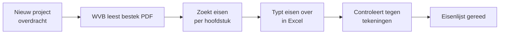

# Stap 04 — Proces-mapping

> **Resultaat van deze stap:** *procesplaten* van je kernprocessen (as-is) met
> gemarkeerde knelpunten waar een agent kan helpen.

## Doel

Zet de belangrijkste processen van de werkvoorbereider op een rij zoals ze nu
lopen (*as-is*). Zoek waar **handwerk, wachttijd en fouten** zitten — dat zijn de
plekken waar een agent waarde toevoegt. Onderscheid daarbij bewust:

- **Augment** — de agent helpt de mens (opzoeken, samenvatten, concept maken).
- **Automate** — de agent voert een stap zelf uit (record aanmaken, mail sturen),
  mens controleert.

## Kernprocessen van de werkvoorbereider

1. Overdracht calculatie → werkvoorbereiding
2. Inkoopproces (behoefte → offerte → vergelijk → gunning → order)
3. Hoeveelheden bepalen (uittrekken)
4. Planningsproces (opstellen, bewaken, bijsturen)
5. Wijzigingsproces / meer-minderwerk
6. Vergunning- & compliancecheck
7. Voortgangs- & kostenbewaking
8. Oplever- & revisiedossier

## Invulvragen (per proces)

1. **Processtappen** — Wat gebeurt er, in welke volgorde? (5–10 stappen)
2. **Rollen** — Wie doet wat? (WVB, inkoper, uitvoerder, calculator, leverancier)
3. **Knelpunten** — Waar zit handwerk, wachttijd, herwerk of fouten?
4. **Trigger** — Wat start het proces? (nieuw project, wijziging, mail)
5. **Agent-kans** — Per knelpunt: *augment* of *automate*? Wat zou de agent doen?

## Voorbeeld uit de bouw

Proces **"bestek → eisenlijst"** (as-is):

**Knelpunten:** het lezen (Z) en overtypen (E) kosten 6–10 uur en zijn foutgevoelig.
**Agent-kans:** *augment* — de agent doorzoekt het bestek, stelt een concept-eisenlijst
met bronverwijzingen voor; de WVB controleert en vult aan (stap C blijft mens).

## Valkuilen

- **Wensproces tekenen.** Teken hoe het *nu echt* gaat, niet hoe het hoort.
- **Alles willen automatiseren.** Begin met *augment* bij oordeels- en
  risicostappen; automatiseer alleen routinematige, goed gedefinieerde stappen.
- **Mens uit de loop halen.** In de bouw hebben fouten (te weinig materiaal,
  gemiste eis) hoge faalkosten. Houd een controlemoment.

## Ingevuld referentievoorbeeld

Zie de procesplaat en knelpunten in
[referentie/usecase-bestek/README.md](../../referentie/usecase-bestek/README.md#stap-04--proces).

---

➡️ Vul de [template](template.md) in en ga door naar
[stap 05 — Use-case prioritering »](../05-usecase-prioritering/)
