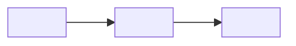

# Template — Proces-mapping (stap 04)

> Vul dit in per kernproces. Herhaal het blok voor elk proces.

## Proces: <naam>
- **Trigger:** <wat start het>
- **Betrokken rollen:** <WVB, inkoper, uitvoerder, ...>

### Stappen (as-is)
1. <stap>
2. <stap>
3. <stap>
4. <stap>
5. <stap>

### Knelpunten
| Stap | Type (handwerk/wachttijd/fout) | Impact | Agent-kans (augment/automate) | Wat zou de agent doen |
|---|---|---|---|---|
| <2> | handwerk | hoog | augment | <concept opstellen met bronnen> |
| <...> | | | | |

### Optioneel: procesplaat

---
> Markeer per proces de 1-2 knelpunten met de hoogste impact — die neem je mee
> naar [stap 05 — Use-case prioritering](../05-usecase-prioritering/).
