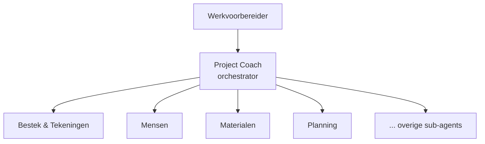

# Stap 06 — Agent-ontwerp

> **Resultaat van deze stap:** een *agent-spec* per gekozen use-case: instructies,
> kennis, tools/acties, triggers en mate van autonomie.
>
> Vanaf hier splitst de blueprint in twee sporen:
> - 🟦 [Business-spoor — Copilot Studio](business-copilot-studio.md)
> - 🟩 [Dev-spoor — Foundry](dev-foundry.md)

## Doel

Vertaal de gekozen use-case(s) uit [stap 05](../05-usecase-prioritering/) naar een
concreet ontwerp — nog platform-onafhankelijk. Een goede agent-spec beschrijft
*wat* de agent doet en *hoe verantwoord*, los van de techniek.

## De 6 bouwstenen van een agent-spec

| Bouwsteen | Vraag | Voorbeeld (bestek-agent) |
|---|---|---|
| **1. Doel & scope** | Wat doet de agent wél en niet? | Doorzoekt bestek/tekeningen en stelt een eisenlijst op. Bestelt niets. |
| **2. Instructies** | Hoe gedraagt de agent zich? Toon, taal, regels. | Nederlands, bouwtaal, altijd bron + hoofdstuk noemen, nooit gokken. |
| **3. Kennis (knowledge)** | Welke ongestructureerde bronnen? | Bestek-PDF, tekeninglijst, contract (uit stap 02). |
| **4. Tools / acties** | Welke gestructureerde acties? | (Bestek-agent: geen. Inkoop-agent: record aanmaken in ERP.) |
| **5. Triggers** | Wanneer/hoe wordt de agent aangeroepen? | WVB stelt een vraag; of "vat de eisen van dit project samen". |
| **5b. Kanalen (channels)** | Waar draait de agent; waar werkt de gebruiker? | Teams; later e-mail/webchat. |
| **6. Autonomie & mens-in-de-loop** | Wat mag de agent zelf? Waar keurt een mens goed? | Stelt concept-eisenlijst voor; WVB controleert en accordeert. |

## Enkele agent of meerdere?

Kies bewust:

- **Enkele agent** — één use-case, overzichtelijk. Prima om te starten.
- **Multi-agent (orchestrator + sub-agents)** — een *coördinerende* agent
  (bv. **Project Coach**) die vragen routeert naar gespecialiseerde sub-agents
  (Bestek, Compliance, Inkoop & Materialen, Planning & Capaciteit, …). Beter als je
  meerdere domeinen wilt afdekken en per domein wilt kunnen doorontwikkelen. Volg de
  [multi-agent-orchestration best practices](../../best-practices/multi-agent-orchestration.md).

> Onze rode draad gebruikt het multi-agent-patroon. Zie
> [referentie/project-coach/architectuur.md](../../referentie/project-coach/architectuur.md).

## Invulvragen

1. Vul per use-case de **6 bouwstenen** in (zie [template](template.md)).
2. Bepaal: **enkele agent** of **onderdeel van een multi-agent-systeem**?
3. Leg het **autonomieniveau** expliciet vast (augment vs. automate uit stap 04).
4. Kies je **spoor**: 🟦 Copilot Studio of 🟩 Foundry (of beide).

## Valkuilen

- **Vage instructies.** "Wees behulpzaam" is te weinig. Schrijf concrete regels:
  bron verplicht, geen aannames, escaleren bij twijfel.
- **Te veel tools.** Elke tool is een risico en een testlast. Alleen wat de
  use-case nodig heeft.
- **Autonomie niet vastgelegd.** Als niet duidelijk is wat de agent zelf mag,
  ontstaat er of te veel of te weinig automatisering.

## Ingevuld referentievoorbeeld

- Bestek-agent-spec: [referentie/usecase-bestek/README.md](../../referentie/usecase-bestek/README.md#stap-06--agent-ontwerp)
- Volledige sub-agent-catalogus: [referentie/project-coach/sub-agents.md](../../referentie/project-coach/sub-agents.md)

---

➡️ Kies je spoor: 🟦 [Copilot Studio](business-copilot-studio.md) · 🟩 [Foundry](dev-foundry.md) — vul de [template](template.md) in — en ga door naar
[stap 07 — Architectuur & integratie »](../07-architectuur-en-integratie/)
