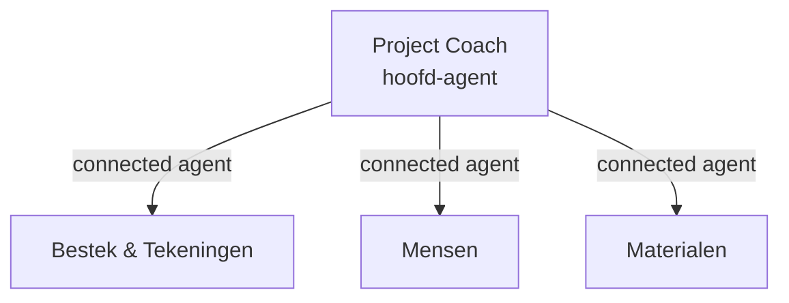

# 🟦 Business-spoor — Agent-ontwerp in Copilot Studio

Dit spoor vertaalt de agent-spec (stap 06) naar **Microsoft Copilot Studio**
(low-code). Geen code nodig — je werkt in de maker-omgeving.

## Van agent-spec naar Copilot Studio

| Agent-spec bouwsteen | In Copilot Studio |
|---|---|
| Doel & scope | Agent-beschrijving + naam |
| Instructies | **Instructions** (het instructieveld van de agent) |
| Kennis | **Knowledge** — SharePoint, publieke website, bestanden, Dataverse |
| Tools / acties | **Tools** — connector-actie, flow, of MCP-server |
| Triggers | **Conversation starters** + het onderwerp/agent-gedrag |
| Multi-agent | **Connected agents** (een agent roept sub-agents aan) |

## Aanpak

1. **Maak de agent** in [Copilot Studio](https://copilotstudio.microsoft.com/) →
   *Create* → *New agent*. Geef naam en beschrijving uit je agent-spec.
2. **Zet de instructies** in het Instructions-veld. Neem de regels uit de spec
   letterlijk over (bron verplicht, geen aannames, escaleren bij twijfel).
3. **Voeg kennis toe** (voor de bestek-agent): koppel de SharePoint-map met het
   bestek als knowledge source. Zie de skill *add-knowledge*.
4. **Voeg tools toe** alleen als de use-case acties vraagt (bv. record aanmaken).
   Zie de skills *add-action* / *add-generative-answers*.
5. **Multi-agent:** bouw de **Project Coach** als hoofd-agent en voeg de
   gespecialiseerde agents toe als **connected agents**. De Coach routeert.

## Multi-agent in Copilot Studio (connected agents)

- De **Project Coach** krijgt instructies om te herkennen *welk domein* een vraag
  betreft en die door te zetten naar de juiste connected agent.
- Elke sub-agent heeft zijn eigen instructies, kennis en tools — en kan los
  worden doorontwikkeld en getest.

## Belangrijk voor deze omgeving (ALM-let op)

> Uit de praktijk: **moderne (new-experience) Copilot Studio-agents kun je niet
> betrouwbaar via `pac copilot push` round-trippen.** Bouw en wijzig moderne
> agents daarom **in de Copilot Studio UI**, niet via CLI-push. Gebruik de CLI
> vooral om te *clonen/inspecteren*. Zie [stap 08](../08-bouwen-en-testen/business-copilot-studio.md).

## Verwijzingen

- Copilot Studio-documentatie: <https://learn.microsoft.com/microsoft-copilot-studio/>
- Connected agents: <https://learn.microsoft.com/microsoft-copilot-studio/authoring-add-other-agents>
- Onze uitgewerkte agents: [referentie/project-coach/](../../referentie/project-coach/)

➡️ Verder naar [stap 07 — Architectuur & integratie »](../07-architectuur-en-integratie/business-copilot-studio.md)
