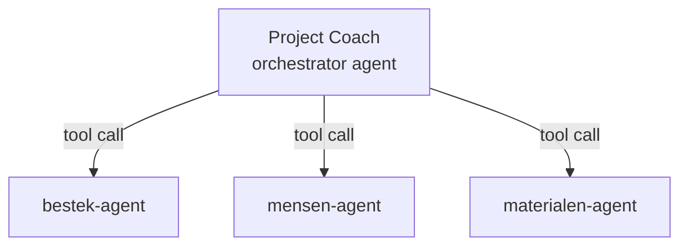

# 🟩 Dev-spoor — Agent-ontwerp in Microsoft Foundry

Dit spoor vertaalt de agent-spec (stap 06) naar **Microsoft Foundry**
(pro-code). Je werkt met `agent.yaml`, tools en de SDK, en beheert alles als code
in deze repo.

## Van agent-spec naar Foundry

| Agent-spec bouwsteen | In Foundry |
|---|---|
| Doel & scope | `name` + `description` in `agent.yaml` |
| Instructies | `instructions` (systeeminstructie) |
| Kennis | Knowledge index / file search tool (RAG) |
| Tools / acties | `tools:` — function tools, MCP-tools, OpenAPI-tools |
| Triggers | Aanroep via SDK / hosted endpoint |
| Multi-agent | Orchestrator-agent die sub-agents als tools aanroept |

## Voorbeeld: `agent.yaml`-skelet (bestek-agent)

> Conceptueel skelet — de volledige uitwerking staat in
> [referentie/usecase-bestek/](../../referentie/usecase-bestek/).

```yaml
name: bestek-agent
description: >
  Doorzoekt bestek en tekeningen van een bouwproject en stelt een eisenlijst
  op met bronverwijzingen. Voert geen bestellingen of wijzigingen uit.
model: gpt-4o            # kies o.b.v. skill microsoft-foundry
instructions: |
  Je bent een assistent voor werkvoorbereiders in de bouw.
  - Antwoord in het Nederlands, met bouwtaal.
  - Baseer je UITSLUITEND op de aangeleverde kennisbronnen.
  - Noem bij elk antwoord de bron: documentnaam + hoofdstuk/paragraaf.
  - Als iets niet in de bron staat: zeg dat expliciet, gok NOOIT.
  - Presenteer eisen als lijst; markeer twijfel of tegenstrijdigheden.
tools:
  - type: file_search    # RAG over bestek/tekeningen
    # index: <knowledge index id>
# geen schrijf-tools: deze agent is 'augment', mens controleert
```

## Multi-agent in Foundry

De **Project Coach** (orchestrator) roept sub-agents aan als tools:



- Elke sub-agent is een eigen `agent.yaml`.
- De orchestrator krijgt instructies om te routeren op domein en resultaten samen
  te voegen.

## Aanpak

1. Scaffold per agent een `agent.yaml` (zie skill **microsoft-foundry** /
   **vscode-microsoft-foundry** voor `azd ai agent`).
2. Zet instructies uit de spec 1-op-1 om.
3. Voeg alleen de tools toe die de use-case vraagt.
4. Houd de agents als code in [referentie/project-coach/](../../referentie/project-coach/)
   en versioneer ze.

## Verwijzingen

- Foundry-agents: <https://learn.microsoft.com/azure/ai-foundry/>
- Skill: `microsoft-foundry` (deploy, evaluate, tools, agent.yaml)

➡️ Verder naar [stap 07 — Architectuur & integratie »](../07-architectuur-en-integratie/dev-foundry.md)
