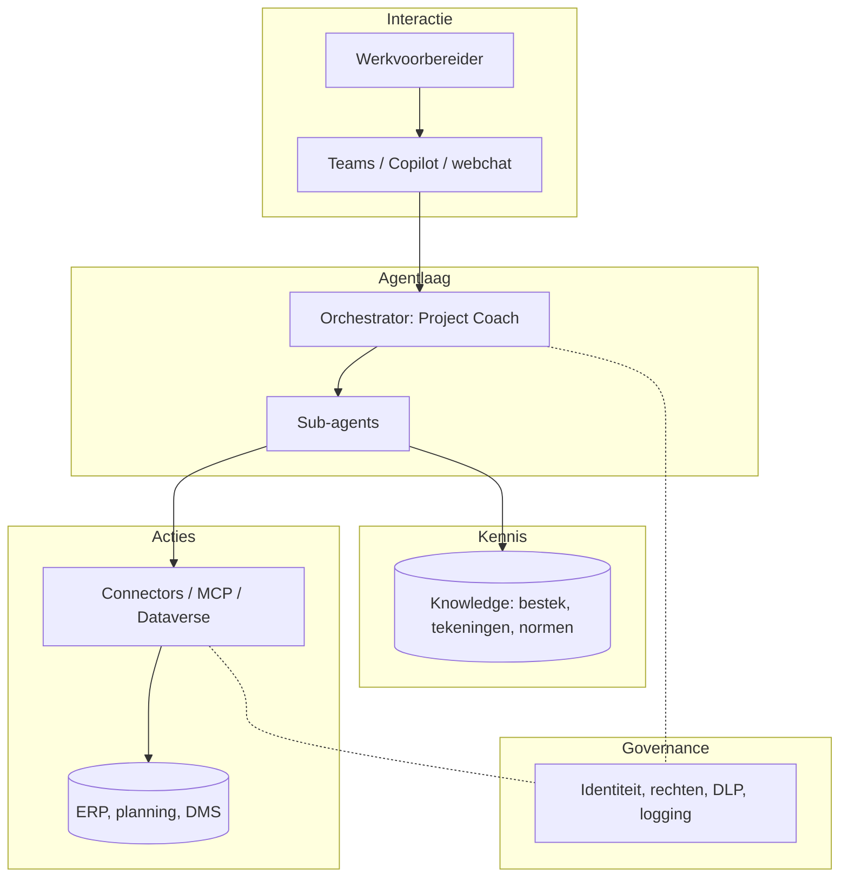

# Stap 07 — Architectuur & integratie

> **Resultaat van deze stap:** een *architectuurplaat* met platformkeuze,
> kennisbronnen, koppelingen en security-model.
>
> Sporen: 🟦 [Copilot Studio](business-copilot-studio.md) · 🟩 [Foundry](dev-foundry.md)

## Doel

Breng samen wat je in stap 02 (data), 03 (systemen) en 06 (agent-ontwerp)
hebt bepaald, tot één plaat: *hoe hangt dit technisch samen en is het veilig?*

## De lagen van een werkvoorbereider-agent

## Beslispunten

1. **Platform** — Copilot Studio (business) en/of Foundry (dev). Mag samen bestaan.
2. **Kennisbronnen** — Welke bronnen uit stap 02 worden geïndexeerd? Hoe wordt
   *revisiebeheer* geborgd (nooit verouderde tekening als waarheid)?
3. **Koppelingen** — Per systeem uit stap 03: connector, MCP, Dataverse of export.
4. **Identiteit & rechten** — Wie is de agent? (Entra ID / service-account)
   Least privilege: alleen de rechten die de use-case vereist.
5. **Security & compliance** — Data-classificatie, DLP-beleid, waar staat data,
   wie mag welke antwoorden zien. Gevoelige data (prijzen, contracten,
   persoonsgegevens) afschermen.
6. **Logging & traceerbaarheid** — Elk antwoord herleidbaar tot bron; acties
   gelogd (belangrijk voor [stap 09](../09-governance-en-adoptie/)).

## Invulvragen

- Welke platformkeuze en waarom?
- Welke kennisbronnen, met welke opschoning/revisieborging?
- Welke koppelingen, met welke rechten (least privilege)?
- Hoe wordt gevoelige data afgeschermd?
- Hoe worden antwoorden en acties gelogd?

## Voorbeeld uit de bouw

> Voor de bestek-agent: **Copilot Studio** (business-spoor), kennisbron =
> SharePoint-projectmap met **alleen de laatst geaccordeerde revisie** van bestek
> en tekeningen. Identiteit via **Entra ID**, alleen-lezen op die map. Geen
> schrijfkoppeling nodig. DLP: prijsbladen staan in een aparte, niet-geïndexeerde
> map. Elk antwoord toont de bron (document + hoofdstuk).

## Valkuilen

- **Revisie-risico.** De grootste bouw-specifieke valkuil: een agent die een
  verouderde tekening/bestek citeert. Borg dat alleen actuele, geaccordeerde
  versies worden geïndexeerd.
- **Te ruime rechten** aan een service-account. Beperk tot de use-case.
- **Security als sluitpost.** Neem classificatie en DLP mee vanaf het ontwerp,
  niet achteraf.

## Ingevuld referentievoorbeeld

- Architectuur & integratiematrix: [referentie/project-coach/architectuur.md](../../referentie/project-coach/architectuur.md)
- Bestek-use-case architectuur: [referentie/usecase-bestek/README.md](../../referentie/usecase-bestek/README.md#stap-07--architectuur)

➡️ Kies je spoor: 🟦 [Copilot Studio](business-copilot-studio.md) · 🟩 [Foundry](dev-foundry.md) — vul de [template](template.md) in — en ga door naar
[stap 08 — Bouwen & testen »](../08-bouwen-en-testen/)
