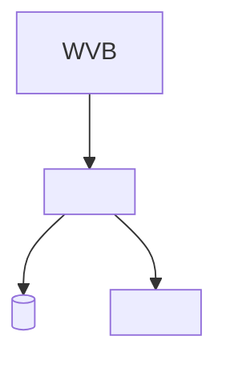

# Template — Architectuurplaat (stap 07)

## Platformkeuze
- **Spoor:** < Copilot Studio | Foundry | beide >
- **Onderbouwing:** <...>

## Kennisbronnen
| Bron | Locatie | Revisie-/opschoonborging | Geïndexeerd? |
|---|---|---|---|
| <bestek> | SharePoint | alleen laatste geaccordeerde revisie | ja |
| <...> | | | |

## Koppelingen (acties)
| Systeem | Vorm (connector/MCP/Dataverse/export) | Rechten (least privilege) | Identiteit |
|---|---|---|---|
| <ERP> | Dataverse | alleen-lezen op projecttabel | service-account |
| <...> | | | |

## Security & compliance
- **Identiteit van de agent:** <Entra ID / service-account>
- **Data-classificatie & DLP:** <welke data afgeschermd, hoe>
- **Gevoelige data uitgesloten van index:** <prijzen, contracten, persoonsgegevens>

## Logging & traceerbaarheid
- **Bronvermelding bij antwoorden:** <ja/hoe>
- **Acties gelogd:** <ja/hoe>

## Architectuurplaat (schets)

