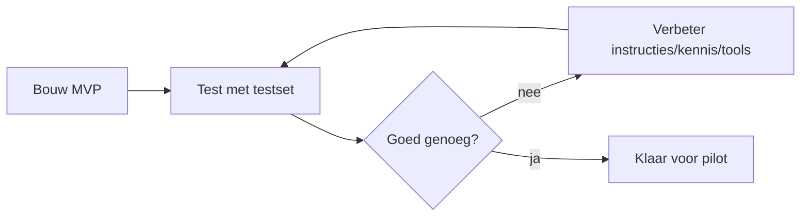

# Stap 08 — Bouwen & testen

> **Resultaat van deze stap:** een werkende **MVP-agent** plus een **testset**
> waarmee je de kwaliteit meet en itereert.
>
> Sporen: 🟦 [Copilot Studio](business-copilot-studio.md) · 🟩 [Foundry](dev-foundry.md)

## Doel

Bouw de kleinste versie die waarde levert (MVP) en meet of hij goed genoeg is.
In de bouw is *betrouwbaarheid* alles: een agent die een eis verkeerd citeert of
een verouderde tekening gebruikt, kost faalkosten. Daarom: testen vóór uitrol.

## Werkwijze: de edit → test → verbeter-lus

## Een testset opbouwen

Verzamel realistische vragen/taken uit de praktijk van de WVB, met het
**verwachte** antwoord of de verwachte actie:

| # | Vraag / taak | Verwacht antwoord/gedrag | Grader |
|---|---|---|---|
| 1 | "Wat is de eis voor brandwerendheid van de scheidingswanden?" | Correcte eis + bron (bestek §..) | betekenis/bron |
| 2 | "Welke isolatiewaarde geldt voor de gevel?" | Correcte Rc-waarde + bron | betekenis/bron |
| 3 | "Staat er iets over geluidsisolatie tussen woningen?" | Ja/nee + bron, geen gok | feitelijk |
| 4 | Vraag over iets dat **niet** in het bestek staat | "Niet gevonden in de bron" (geen gok!) | weigering |

> Neem bewust **negatieve tests** op (vraag 4): de agent moet durven zeggen
> *"dat staat niet in de bron"*. Dit is in de bouw belangrijker dan een vlot
> antwoord.

## Invulvragen

1. Wat is de MVP-scope (kleinste waardevolle versie)?
2. Welke 10–20 testvragen dekken de use-case, inclusief negatieve tests?
3. Welke graders/criteria bepalen "goed genoeg"? (correctheid, bronvermelding,
   geen hallucinatie)
4. Wat is de drempel om naar pilot te gaan?

## Valkuilen

- **Alleen "happy path" testen.** Test juist randgevallen en dingen die *niet*
  in de bron staan.
- **Subjectief "voelt goed".** Gebruik een vaste testset zodat je verbeteringen
  objectief kunt meten.
- **Groot uitrollen zonder pilot.** Start met een paar WVB's; leer; schaal daarna.

## Testmethodes & metrics (Copilot Studio)

Copilot Studio biedt drie **testmethodes**: **text match**, **similarity** en
**quality/groundedness** (relevantie, groundedness, volledigheid). **Evalueer vóór
je publiceert**, houd een **baseline** aan en detecteer **regressie**. Relevante
**metrics**: groundedness, instruction-following, topic-match en citation-accuracy.
Bron: [Evaluate an agent](https://learn.microsoft.com/microsoft-copilot-studio/agents-experience/analytics-agent-evaluation-intro)
· [metrics](https://learn.microsoft.com/microsoft-copilot-studio/guidance/agent-business-value-metrics-reference).
Zie ook [best-practices/copilot-studio.md](../../best-practices/copilot-studio.md).

## Ingevuld referentievoorbeeld

Zie de volledige testset voor de bestek-agent in
[referentie/usecase-bestek/README.md](../../referentie/usecase-bestek/README.md#stap-08--testen).

➡️ Kies je spoor: 🟦 [Copilot Studio](business-copilot-studio.md) · 🟩 [Foundry](dev-foundry.md) — vul de [template](template.md) in — en ga door naar
[stap 09 — Governance & adoptie »](../09-governance-en-adoptie/)
