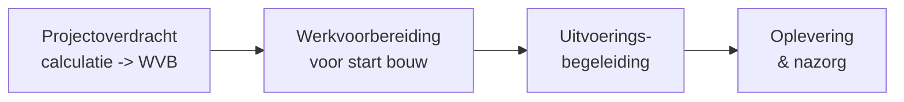

# De Blueprint — werk van de werkvoorbereider als vertrekpunt

Voordat je een agent bouwt, moet je het **vak** begrijpen. Dit hoofdstuk geeft
de domein-analyse van de werkvoorbereider in de bouw en legt uit hoe je de
9 stappen doorloopt.

---

## 1. Wat doet een werkvoorbereider (WVB)?

De werkvoorbereider is de **spil tussen calculatie/verkoop en uitvoering**.
Hij/zij vertaalt contract, bestek en tekeningen naar een uitvoerbaar,
ingekocht en gepland project — en bewaakt dat tijdens de bouw.

> *"Zorgen dat de uitvoering kan bouwen zonder stil te vallen — met de juiste
> spullen, mensen, tekeningen en vergunningen, op het juiste moment, binnen
> budget."*

### Rolvarianten (belangrijk: de blueprint is configureerbaar)

| Segment | Focus | Andere data/systemen |
|---|---|---|
| **B&U – woningbouw** | Prefab, repetitie, hoeveelheden, inkoop | STABU-bestek, Revit/BIM |
| **B&U – utiliteitsbouw** | Complexe installaties, coördinatie disciplines | BIM-coördinatie, clash-detectie |
| **GWW / infra** | Grondstromen, RAW-bestek, verkeersmaatregelen | RAW/CROW, GEO/GIS |
| **Installatietechniek (E&W)** | Materiaalstaten, engineering, prefab leidingwerk | Stabicad, Vabi |
| **Onderhoud / renovatie** | Kleine orders, snelheid, opnames | Servicedesk, mobiel |

Bepaal in [stap 00](00-context-en-ambitie/) welk segment op jou van toepassing is.

---

## 2. Fasen en kerntaken

**1. Projectoverdracht (calculatie → uitvoering)**
Overdrachtsdossier doorgronden · bestek, tekeningen en contract (UAV / UAV-GC)
bestuderen · risico-inventarisatie · verschil inschrijf- vs. werkbegroting bepalen.

**2. Werkvoorbereiding (voor start bouw)**
Detail-/uitvoeringsplanning · **inkoopschema** · **hoeveelheden uittrekken** ·
offertes aanvragen en vergelijken · materialen bestellen · onderaannemers
contracteren · vergunningen/ontheffingen · werkplannen, KAM-/V&G-plan ·
werktekeningen · afstemmen met constructeur, architect en installateur.

**3. Uitvoeringsbegeleiding**
Planning en voortgang bewaken · kosten bewaken · tekeningrevisies beheren ·
**meer-/minderwerk** registreren en onderbouwen · leveringen/logistiek ·
technische vragen van de bouwplaats · voortgangsrapportages.

**4. Oplevering & nazorg**
Oplever-/revisiedossier · restpunten bewaken · nacalculatie · garantie en onderhoud.

---

## 3. Data die een werkvoorbereider gebruikt

De 8 datacategorieën vormen de basis voor [stap 02](02-data-inventarisatie/).
Let op **gestructureerd vs. ongestructureerd** — dat bepaalt hoe een agent de
data kan gebruiken.

| # | Categorie | Voorbeelden | Aard |
|---|---|---|---|
| A | Ontwerp & contract | Bestek (STABU/RAW), tekeningen (bouwkundig/constructief/installatie), BIM/IFC, contract & voorwaarden, contractplanning | Mix (PDF/DWG + IFC) |
| B | Calculatie & kosten | Inschrijf-/werkbegroting, eenheidsprijzen/normen, meer-/minderwerk | Gestructureerd |
| C | Hoeveelheden & materiaal | Hoeveelhedenstaat/uittrekstaat, stuklijsten, wapening-/zaagstaten, bestellijsten | Semi-gestructureerd |
| D | Inkoop & partners | Leveranciers-/onderaannemersdata, offertes, raamcontracten, inkoopschema | Mix |
| E | Planning & voortgang | Uitvoerings-/weekplanning, leverschema, mijlpalen, voortgangsrapportages | Gestructureerd |
| F | Regelgeving & compliance | Bbl/Bouwbesluit, NEN-normen, omgevingsvergunning, RI&E/V&G, BENG/MPG/stikstof | Ongestructureerd |
| G | Uitvoering & bouwplaats | Werkbonnen, urenregistratie, dagrapporten, keuringen, foto's, restpunten | Mix + beeld |
| H | Communicatie & administratie | Mail, notulen bouwvergadering, wijzigingsverzoeken, correspondentie directie | Ongestructureerd |

---

## 4. Systemen in de Nederlandse bouwpraktijk

De basis voor [stap 03](03-systeem-inventarisatie/).

| Domein | Voorbeeldsystemen |
|---|---|
| ERP / bouwadministratie | 4PS Construct (Dynamics 365), Metacom, Bouw7, Syntess, Ibis Main |
| Calculatie | IBIS-TRAD / IBIS 4All, Cordel, KUBUS |
| Planning | MS Project, Primavera P6, Asta Powerproject, KYP Project, Tim |
| BIM / CAD | Revit, AutoCAD, Navisworks, Solibri, Tekla, Stabicad |
| Bouwplaats / DMS | Dalux, Ed Controls, Snagstream, Bouwapp, Relatics |
| Field service & projecten (Dataverse) | Dynamics 365 Field Service, Dynamics 365 Project Operations |
| Bestek-systematiek | STABU (B&U), RAW / CROW (GWW) |
| Kantoor / communicatie | Microsoft 365 (Excel!, Outlook, SharePoint, Teams), WhatsApp |

**Cruciaal:** welke *integratievorm* biedt elk systeem — API/connector, MCP-server,
of alleen bestandsexport (Excel/PDF/IFC)? Dat bepaalt of een agent kan *lezen*,
*schrijven* of alleen *interpreteren*.

---

## 5. Kernprocessen (waar de agent op inhaakt)

De basis voor [stap 04](04-proces-mapping/).

1. Overdracht calculatie → werkvoorbereiding
2. Inkoopproces (behoefte → offerte → vergelijk → gunning → order)
3. Hoeveelheden bepalen (uittrekken uit tekening/BIM/bestek)
4. Planningsproces (opstellen, bewaken, bijsturen)
5. Wijzigingsproces / meer-minderwerk
6. Vergunning- & compliancecheck
7. Voortgangs- & kostenbewaking
8. Oplever- & revisiedossier

---

## 6. Waar helpt een AI-agent? (pijn → kans)

De basis voor [stap 05](05-usecase-prioritering/).

| Pijnpunt WVB | Agent-kans | Type |
|---|---|---|
| Bestek/tekeningen doorspitten kost uren | Doorzoeken, samenvatten, eisen extraheren | Kennis / RAG |
| Hoeveelheden handmatig uittrekken | Uittrekken uit BIM/tekening ondersteunen | Tool + kennis |
| Inkoopschema samenstellen | Genereren o.b.v. planning + hoeveelheden | Actie |
| Offertes vergelijken | Normaliseren en vergelijken | Analyse |
| Normen/Bbl-vragen | Q&A op regelgeving mét bronnen | Kennis / RAG |
| Meer-/minderwerk onderbouwen | Detecteren, registreren, brief opstellen | Actie |
| Leveranciers aanschrijven | Concept-mails genereren | Actie |
| Voortgang/opleverdossier | Rapport/dossier samenstellen | Actie |

---

## 7. Twee sporen vanaf stap 06

Stap 00–05 zijn **gedeeld** (analyse en keuzes). Vanaf stap 06 splitst de
blueprint:

- **Business-spoor** → [Microsoft Copilot Studio](https://learn.microsoft.com/microsoft-copilot-studio/)
  (low-code): agents, kennisbronnen, topics, acties via connectors/MCP,
  samenwerkende (connected) agents.
- **Dev-spoor** → [Microsoft Foundry](https://learn.microsoft.com/azure/ai-foundry/)
  (pro-code): `agent.yaml`, SDK, tools, evaluaties.

Elk hoofdstuk 06–08 heeft daarom naast `README.md` (gedeeld) twee bijlagen:
`business-copilot-studio.md` en `dev-foundry.md`.

---

## 8. De rode draad: een werkvoorbereidingsagent

Door de hele blueprint volgen we één uitgewerkt voorbeeld — een
**Project Coach** die samenwerkt met gespecialiseerde sub-agents (Mensen,
Materialen, Bestek & Tekeningen, Planning, Inkoop, Compliance,
Meer-/minderwerk, Oplever & Kwaliteit). Zie
[referentie/](../referentie/) voor de architectuur en
[referentie/usecase-bestek/](../referentie/usecase-bestek/) voor één diep
uitgewerkte use-case.

Begin bij [stap 00 — Context & ambitie »](00-context-en-ambitie/)
