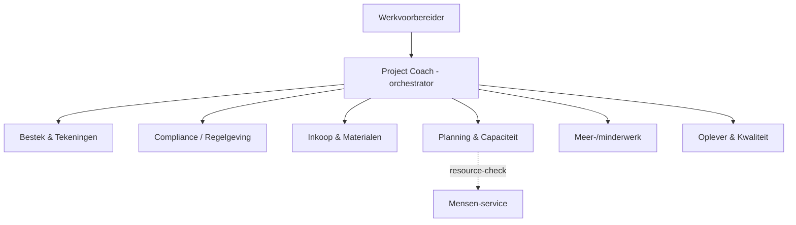

# Referentie — de rode draad

Deze map bevat het **volledig uitgewerkte voorbeeld** dat door de hele blueprint
loopt: een werkvoorbereidingsagent voor een (fictieve) middelgrote B&U-aannemer.

## Wat vind je hier?

| Onderdeel | Beschrijving |
|---|---|
| [project-coach/architectuur.md](project-coach/architectuur.md) | De multi-agent architectuur: **Project Coach** (orchestrator) + sub-agents, met ingevuld contextprofiel, taken-canvas en integratiematrix |
| [project-coach/sub-agents.md](project-coach/sub-agents.md) | Catalogus van de **6 kern-sub-agents** + de **Mensen-service**, met de decompositie-verantwoording |
| [agent-skeletons/README.md](agent-skeletons/README.md) | Consistente **skeletons** per agent (doel, systemen FS/PO, mock-plan) — het hele team klaar voor de demo |
| [usecase-bestek/README.md](usecase-bestek/README.md) | Eén use-case volledig door alle 9 blueprint-stappen: **"Bestek & tekeningen doorzoeken en eisen samenvatten"** |
| [usecase-compliance/README.md](usecase-compliance/README.md) | Tweede use-case door alle 9 stappen: **"Compliance / Bouwbesluit-(Bbl-)Q&A met bronnen"** |
| [usecase-meerminderwerk/README.md](usecase-meerminderwerk/README.md) | Derde use-case door alle 9 stappen: **"Meer-/minderwerk signaleren en onderbouwen"** |
| [usecase-inkoop-materialen](usecase-inkoop-materialen/README.md) · [Planning & Capaciteit](usecase-planning/README.md) · [oplever](usecase-oplever/README.md) · [Mensen-service](usecase-mensen/README.md) | De **actie-agents** (Field Service / Project Operations), elk volledig door de 9 stappen |
| [rocket-principe.md](rocket-principe.md) | Het **ROCKET**-stramien voor agent-instructies (Role · Objective · Context · Key results · Examples · Tone) |

## De rode draad in het kort

> Een middelgrote **B&U-aannemer** wil zijn 6 werkvoorbereiders ondersteunen met
> een **Project Coach** — een agent die als eerste aanspreekpunt fungeert en
> vragen doorzet naar **6 kern-sub-agents** plus de herbruikbare **Mensen-service**.
> De sub-agents zijn ontworpen op **WVB-domein** (niet per bronsysteem); zie de
> [decompositie-verantwoording](project-coach/architectuur.md#decompositie-verantwoording).

> **6 kern-sub-agents** (ontworpen op WVB-domein) + de herbruikbare **Mensen-service**.
> Alle agents zijn volledig uitgewerkt; de onderbouwing van deze indeling staat in de
> [decompositie-verantwoording](project-coach/architectuur.md#decompositie-verantwoording).

Begin bij de [architectuur »](project-coach/architectuur.md)
