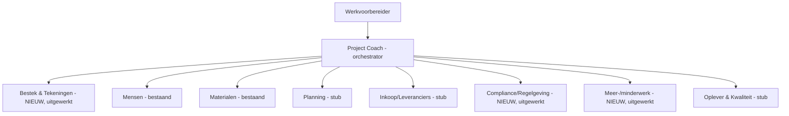

# Referentie — de rode draad

Deze map bevat het **volledig uitgewerkte voorbeeld** dat door de hele blueprint
loopt: een werkvoorbereidingsagent voor een (fictieve) middelgrote B&U-aannemer.

## Wat vind je hier?

| Onderdeel | Beschrijving |
|---|---|
| [project-coach/architectuur.md](project-coach/architectuur.md) | De multi-agent architectuur: **Project Coach** (orchestrator) + sub-agents, met ingevuld contextprofiel, taken-canvas en integratiematrix |
| [project-coach/sub-agents.md](project-coach/sub-agents.md) | Catalogus van alle sub-agents (Mensen, Materialen, Bestek & Tekeningen, Planning, Inkoop, Compliance, Meer-/minderwerk, Oplever) |
| [usecase-bestek/README.md](usecase-bestek/README.md) | Eén use-case volledig door alle 9 blueprint-stappen: **"Bestek & tekeningen doorzoeken en eisen samenvatten"** |
| [usecase-compliance/README.md](usecase-compliance/README.md) | Tweede use-case door alle 9 stappen: **"Compliance / Bouwbesluit-(Bbl-)Q&A met bronnen"** |
| [usecase-meerminderwerk/README.md](usecase-meerminderwerk/README.md) | Derde use-case door alle 9 stappen: **"Meer-/minderwerk signaleren en onderbouwen"** |

## De rode draad in het kort

> Een middelgrote **B&U-aannemer** wil zijn 6 werkvoorbereiders ondersteunen met
> een **Project Coach** — een agent die als eerste aanspreekpunt fungeert en
> vragen doorzet naar gespecialiseerde sub-agents. Er bestaan al een **Mensen
> agent** (bemensing) en een **Materialen agent** (materialen/inkoop). Deze
> blueprint breidt dat uit naar een compleet, samenwerkend team van sub-agents,
> en werkt drie nieuwe sub-agents — **Bestek & Tekeningen**,
> **Compliance / Regelgeving** en **Meer-/minderwerk** — volledig uit.

> "Stub" = globaal opgezet (doel + scope beschreven), nog niet volledig
> uitgewerkt. Zo staat het hele systeem op de kaart, terwijl je één use-case diep
> uitwerkt — precies de aanpak van deze blueprint.

Begin bij de [architectuur »](project-coach/architectuur.md)
