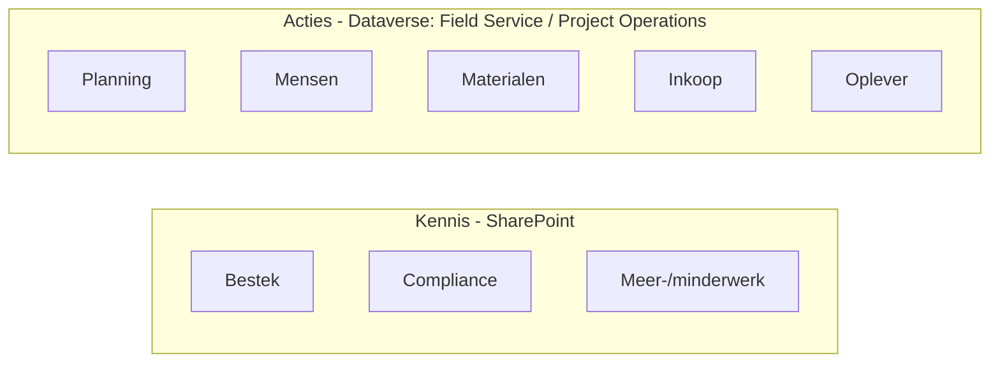

# Agent-skeletons — het hele team in kaart

Elke sub-agent van de **Project Coach** heeft hier een **consistent skelet**: een
lichtgewicht spec die precies genoeg vastlegt om (a) het team compleet te maken en
(b) de **gemockte demo** (Fase B) te kunnen bouwen met M365 + Power Apps.

Alle agents zijn inmiddels **diep** uitgewerkt in de `usecase-*`-mappen; dit blijft
het beknopte skelet-overzicht (doel, systemen, mock-plan) van het hele team.

---

## Skelet-format (per agent)

1. **Doel** — één regel.
2. **Fase** — welke fase(n) van de werkvoorbereider.
3. **Kennis/data** — *SharePoint = augment (kennis)* / *Dataverse (Field Service /
   Project Operations) = automate (acties)*.
4. **Systemen** — mapping naar **Field Service** / **Project Operations** (of SharePoint).
5. **Tools/acties** — onderscheid *augment* (opzoeken/samenvatten) vs. *automate*
   (schrijven, met mens-akkoord).
6. **Autonomie & mens-in-de-loop**.
7. **Triggers / voorbeeldvragen**.
8. **Mock-plan** — welke mockdata, in welk M365/Power Platform-element, met 2–3
   voorbeeldrecords (rond "De Beemster").
9. **Status** + link naar diepe use-case (indien aanwezig).

---

## Het team in één tabel

| Agent | Laag | Primaire bron (mock voor demo) | Status |
|---|---|---|---|
| **Project Coach** (orchestrator) | routeert | — | [architectuur »](../project-coach/architectuur.md) |
| Bestek & Tekeningen | augment | SharePoint — bestek/tekeningen | ✅ diep → [usecase](../usecase-bestek/README.md) |
| Compliance / Regelgeving | augment | SharePoint — Bbl/normen | ✅ diep → [usecase](../usecase-compliance/README.md) |
| Meer-/minderwerk | augment→automate | SharePoint — wijzigingen (+ PO change orders) | ✅ diep → [usecase](../usecase-meerminderwerk/README.md) |
| Planning | automate | **Project Operations** — WBS/taken | ✅ [usecase](../usecase-planning/README.md) · [skelet](planning.md) |
| Mensen | automate | **Field Service** — bookable resources | ✅ [usecase](../usecase-mensen/README.md) · [skelet](mensen.md) |
| Materialen | automate | **Field Service** — voorraad/producten | ✅ [usecase](../usecase-materialen/README.md) · [skelet](materialen.md) |
| Inkoop / Leveranciers | augment→automate | **Project Operations** — inkoop/estimates | ✅ [usecase](../usecase-inkoop/README.md) · [skelet](inkoop-leveranciers.md) |
| Oplever & Kwaliteit | automate | **Field Service** — werkorders/inspecties | ✅ [usecase](../usecase-oplever/README.md) · [skelet](oplever-kwaliteit.md) |

---

## Twee lagen (rode draad)

- **Augment-agents** leunen op **SharePoint**-kennis (documenten) — ze zoeken,
  vatten samen, stellen concepten voor. Mens beslist.
- **Automate-agents** leunen op **Dataverse** (Field Service / Project Operations) —
  ze lezen gestructureerde data en kunnen (later, met akkoord) records schrijven.

## Van skelet naar demo (Fase B)

Elk **mock-plan** (veld 8) wijst aan welke **SharePoint-lijst** of **Dataverse-tabel**
we in de demo vullen met mockdata. Zo bootsen we Field Service / Project Operations
na zonder een echte omgeving, en kan elke agent in Copilot Studio op die mock-bron
worden aangesloten. Zie de backlog in de repo voor de Fase B-runbook.

> Alle mockdata is **fictief** (rond "De Beemster"); bedragen zijn illustratief.
