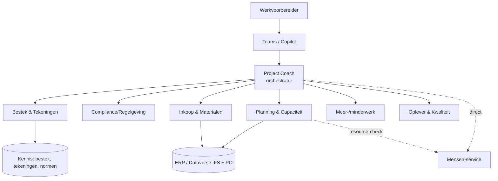

# Project Coach — architectuur (referentie)

Dit document is het ingevulde resultaat van blueprint-stap 00, 01, 03 en 07 voor
onze rode-draad-casus. Het beschrijft de multi-agent architectuur van een
werkvoorbereidingsagent.

---

## Contextprofiel

*(ingevuld voorbeeld bij [blueprint stap 00](../../blueprint/00-context-en-ambitie/))*

- **Bedrijf:** fictieve middelgrote **B&U-aannemer** (woning- en utiliteitsbouw).
- **Aantal werkvoorbereiders:** 6.
- **Rolinvulling:** alle fasen — overdracht, werkvoorbereiding,
  uitvoeringsbegeleiding, oplevering.
- **Digitaliseringsniveau:** *gevorderd* — 4PS Construct (ERP), IBIS (calculatie),
  Revit (BIM), veel Excel en Outlook.
- **Ambitie:** starten met **assisteren** (sneller door bestek/tekeningen), daarna
  **automatiseren** (inkoopschema, meer-/minderwerk).
- **Succesmaat:** elke WVB bespaart ~3 uur/week zoek- en overtypwerk; minder
  faalkosten door gemiste eisen.

---

## Taken-canvas

*(ingevuld voorbeeld bij [blueprint stap 01](../../blueprint/01-rol-en-taakanalyse/))*

| Taak | Fase | Frequentie | Tijd/keer | Pijn | Waarde | Data/systemen |
|---|---|---|---|---|---|---|
| Bestek & tekeningen bestuderen | overdracht | per project | 6-10 u | 4 | 5 | bestek PDF, tekeningen, DMS |
| Hoeveelheden uittrekken | werkvoorbereiding | per project | 4-8 u | 4 | 5 | tekeningen, BIM, calc |
| Inkoopschema opstellen | werkvoorbereiding | per project | 4-6 u | 3 | 5 | planning, hoeveelheden, ERP |
| Offertes vergelijken | werkvoorbereiding | wekelijks | 1-2 u | 3 | 4 | offertes (PDF), ERP |
| Meer-/minderwerk behandelen | uitvoering | wekelijks | 1-3 u | 4 | 4 | wijzigingen, tekeningen, ERP |
| Bemensing/planning arbeid | uitvoering | wekelijks | 1-2 u | 3 | 4 | rooster, certificaten |
| Opleverdossier samenstellen | oplevering | per project | 4-8 u | 3 | 3 | keuringen, revisies, foto's |

**Top-taken (pijn × waarde):** bestek bestuderen, hoeveelheden uittrekken,
meer-/minderwerk. → gekozen eerste use-case: **bestek bestuderen** (hoogste
waarde, best haalbaar; zie [stap 05](../../blueprint/05-usecase-prioritering/)).

---

## Multi-agent architectuur

We kiezen het **orchestrator + sub-agents**-patroon. De **Project Coach** is het
eerste aanspreekpunt voor de werkvoorbereider en routeert vragen naar de juiste
gespecialiseerde sub-agent.

**Waarom multi-agent?**

- Elk **domein** (bestek, compliance, inkoop & materialen, planning, …) heeft eigen
  data, systemen en regels. We decomponeren op **WVB-domein**, niet per bronsysteem.
- Sub-agents kunnen **los** worden ontwikkeld, getest en verbeterd.
- De werkvoorbereider heeft **één** ingang (de Coach) en hoeft niet te weten welke
  agent wat doet.

**Project Coach — rol & instructie (samengevat):**

- Herkent op basis van de vraag *welk domein* het betreft.
- Zet de vraag door naar de juiste sub-agent (connected agent / tool call).
- Voegt antwoorden samen en houdt projectcontext (welk project, welke fase).
- Vraagt om verduidelijking bij twijfel; verzint nooit een antwoord zelf.

De volledige sub-agent-catalogus staat in [sub-agents.md](sub-agents.md).

---

## Decompositie-verantwoording

We decomponeren bewust op **domein van de werkvoorbereider** (jobs-to-be-done), niet
per bronsysteem. Dat sluit aan op de Microsoft multi-agent best practices ("splits
alleen bij een echt apart kennis/tools-domein, andere governance of herbruik; 1
kennisbron per sub-agent, geen overlap").

**6 kern-sub-agents + 1 herbruikbare service:**

| Domein | Waarom apart | Laag |
|---|---|---|
| Bestek & Tekeningen | eigen kennisdomein (bestek/tekeningen) | augment |
| Compliance / Regelgeving | aparte governance (juridisch), eigen kennis (Bbl/NEN) | augment |
| Inkoop & Materialen | één inkoop-/materiaalproces (behoefte→voorraad→offerte→bestellen) | augment→automate |
| Planning & Capaciteit | eigen data (WBS/mijlpalen); **eigenaar van het schema** | automate |
| Meer-/minderwerk | financieel/contractueel, eigen governance | augment→automate |
| Oplever & Kwaliteit | eigen data (keuringen/restpunten/assets) | automate |
| **Mensen** (service) | **herbruikbaar** + aparte governance (**certificaten/AVG**) | automate |

**Bewuste keuzes (t.o.v. de eerdere 8-agent-opzet):**

- **Materialen samengevoegd met Inkoop** → *Inkoop & Materialen*. Voor de WVB is dit
  één proces; los houden gaf **overlappende beschrijvingen** en routing-verwarring.
- **Mensen** blijft **apart**, maar als **herbruikbare service** (bestaat al als
  Mensen agent 2.0; certificaten/**AVG** = eigen governance). **Planning & Capaciteit**
  bezit het schema en roept de Mensen-service aan voor beschikbaarheid — zo vermijden
  we schedule-overlap tussen Planning en Mensen.
- **Systemen (Field Service / Project Operations) zijn een data-/toollaag**, geen
  agent-grens. Meerdere agents delen dezelfde Dataverse-backbone.

---

## Integratiematrix

*(ingevuld voorbeeld bij [blueprint stap 03](../../blueprint/03-systeem-inventarisatie/))*

| Systeem | Functie | Data (cat.) | Integratievorm | Rechten | Voor welke sub-agent |
|---|---|---|---|---|---|
| SharePoint (projectmap) | DMS | A, H | export / knowledge source | lezen | Bestek & Tekeningen, Compliance |
| Field Service (Dataverse) | Werkorders/resources/voorraad | C, G | Dataverse | lezen | Inkoop & Materialen, Mensen-service, Oplever |
| Project Operations (Dataverse) | Projecten/WBS/inkoop | B, D, E | Dataverse | lezen | Planning & Capaciteit, Inkoop & Materialen |
| 4PS Construct (Dynamics 365) | ERP | B, C, D | Dataverse | lezen (later schrijven) | Inkoop & Materialen |
| Rooster/HR-systeem | Bemensing | — | connector / Dataverse | lezen | Mensen-service |
| IBIS | Calculatie | B, C | export | interpreteren | Inkoop & Materialen, Meer-/minderwerk |
| Revit / BIM-server | BIM | A, C | export (IFC) | interpreteren | Bestek, Inkoop & Materialen |
| Bouwapp / Dalux | Bouwplaats | G | connector (indien beschikbaar) | lezen | Oplever & Kwaliteit |

**Least privilege:** de Bestek & Tekeningen-agent krijgt alleen-lezen toegang tot
de projectmap met **actuele, geaccordeerde revisies**. Prijsbladen en contracten
staan in een aparte, niet-geïndexeerde map.

---

## Platformkeuze

- **Business-spoor (Copilot Studio):** Project Coach + sub-agents als
  **connected agents**; kennis via SharePoint/Dataverse; acties via
  Dataverse-/Power Platform-connectors en MCP.
- **Dev-spoor (Foundry):** elke agent als `agent.yaml`; orchestrator roept
  sub-agents aan als tools; kennis via knowledge index (file search).

> Beide sporen kunnen naast elkaar bestaan: begin low-code met de bestek-agent in
> Copilot Studio, en bouw diepere integraties (bijv. hoeveelheden uit BIM) in
> Foundry.

Zie de sub-agent-catalogus in [sub-agents.md](sub-agents.md) en de volledige
uitwerking van de eerste use-case in
[../usecase-bestek/README.md](../usecase-bestek/README.md).
