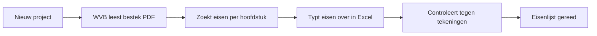
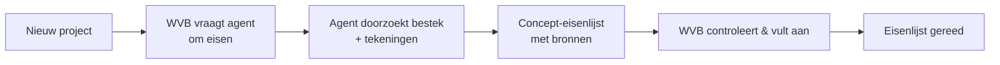

# Use-case: Bestek & tekeningen doorzoeken en eisen samenvatten

Dit is de **volledig uitgewerkte** eerste use-case van onze rode draad —
de **Bestek & Tekeningen-agent** — doorlopen langs alle 9 blueprint-stappen.
Gebruik dit als ingevuld voorbeeld naast de lege templates.

> **Samenvatting:** de werkvoorbereider vraagt de agent naar eisen in het bestek
> ("wat is de eis voor brandwerendheid?"). De agent doorzoekt bestek en
> tekeningen, geeft antwoord **met bronvermelding**, en stelt een concept-eisenlijst
> op. Hij bestelt niets en oordeelt niet over regelgeving. De WVB controleert.

Het bijbehorende fictieve bronmateriaal staat in [../../voorbeelddata/](../../voorbeelddata/).

---

## Stap 00 — Context

B&U-aannemer, 6 werkvoorbereiders, digitaliseringsniveau *gevorderd*.
Ambitie voor deze use-case: **assisteren** (augment). Succesmaat: 3 uur/week minder
zoekwerk per WVB en minder gemiste eisen. Zie
[project-coach/architectuur.md](../project-coach/architectuur.md#contextprofiel).

## Stap 01 — Taak

**Taak:** "bestek & tekeningen bestuderen" (fase overdracht). Frequentie: elk
project. Tijd: 6–10 uur. Pijn (4/5): zoekwerk + risico iets te missen. Waarde
(5/5): minder faalkosten, snellere start.

## Stap 02 — Data

| Bron | Cat. | Locatie | Formaat | Structuur | Kwaliteit | Toegang | Gevoeligheid |
|---|---|---|---|---|---|---|---|
| Bestek | A | SharePoint projectmap | PDF | O | goed, mits juiste revisie | export/knowledge | vertrouwelijk |
| Tekeninglijst | A | SharePoint / Bouwapp | PDF/DWG | O | revisiebeheer let op! | export/knowledge | vertrouwelijk |
| Contract / UAV | A | SharePoint | PDF | O | stabiel | export/knowledge | vertrouwelijk |

**Kennisbron (RAG):** bestek + tekeninglijst + contract.
**Actiedata:** geen (deze agent schrijft niets).
**Aandachtspunt:** alleen de **laatst geaccordeerde revisie** indexeren; prijsbladen
uitsluiten. Zie [voorbeelddata](../../voorbeelddata/).

## Stap 03 — Systemen

Alleen **SharePoint** (projectmap) als knowledge source; **Entra ID**, alleen-lezen.
Geen schrijfkoppeling. Zie
[project-coach/architectuur.md](../project-coach/architectuur.md#integratiematrix).

## Stap 04 — Proces

As-is:



**Knelpunt:** lezen (Z) + overtypen (E) = 6–10 u, foutgevoelig.
**Agent-kans:** *augment* — agent doorzoekt bestek, stelt concept-eisenlijst met
bronnen voor; WVB controleert (stap C blijft mens).

To-be:



## Stap 05 — Prioritering

Waarde 5, haalbaarheid 4 (kennisbron, augment, geen schrijfkoppeling) →
**quick win, als eerste gekozen**. Zie
[blueprint stap 05](../../blueprint/05-usecase-prioritering/).

## Stap 06 — Agent-ontwerp

**Agent: Bestek & Tekeningen**

1. **Doel & scope** — Doorzoekt bestek/tekeningen en stelt eisenlijst op met
   bronnen. Doet **niet:** bestellen, wijzigen, regelgeving beoordelen.
2. **Instructies:**
   ```
   Je bent een assistent voor werkvoorbereiders in de bouw (B&U).
   - Antwoord in het Nederlands, met bouwtaal.
   - Baseer je UITSLUITEND op de aangeleverde kennisbronnen (bestek, tekeningen,
     contract). Gebruik geen algemene kennis als feit.
   - Noem bij ELK inhoudelijk antwoord de bron: documentnaam + hoofdstuk/paragraaf.
   - Staat iets niet in de bron? Zeg dat expliciet ("niet gevonden in het bestek").
     Gok NOOIT.
   - Presenteer eisen als een genummerde lijst. Markeer twijfel, dubbelingen of
     tegenstrijdigheden tussen bestek en tekening.
   - Je bestelt niets, wijzigt niets en geeft geen juridisch/normadvies.
   ```
3. **Kennis:** bestek-PDF, tekeninglijst, contract (actuele revisie).
4. **Tools:** geen.
5. **Triggers:** vraag van de WVB; conversation starters zoals *"Vat de eisen van
   dit project samen"* of *"Wat staat er over brandveiligheid?"*.
6. **Autonomie:** *augment* — concept, WVB accordeert.

Positie: **sub-agent** onder Project Coach. Zie
[sub-agents.md](../project-coach/sub-agents.md).

## Stap 07 — Architectuur

- **Spoor:** business (Copilot Studio) voor de eerste versie.
- **Kennis:** SharePoint-projectmap, alleen actuele geaccordeerde revisies;
  prijsbladen uitgesloten.
- **Identiteit:** Entra ID, alleen-lezen op de projectmap.
- **Logging:** elk antwoord toont bron; vragen/antwoorden gelogd.
- **Bouw-risico geborgd:** revisiebeheer — index alleen de geaccordeerde versie.

Dev-variant (Foundry): `file_search`-tool over een knowledge index; zie
[blueprint 07 dev-foundry](../../blueprint/07-architectuur-en-integratie/dev-foundry.md).

## Stap 08 — Testen

Testset (uittreksel — negatieve tests bewust inbegrepen):

| # | Vraag | Verwacht | Grader |
|---|---|---|---|
| 1 | Wat is de eis voor brandwerendheid van de woningscheidende wanden? | Correcte WBDBO-eis + bron (bestek §..) | betekenis + bron |
| 2 | Welke Rc-waarde geldt voor de gevel? | Correcte Rc-waarde + bron | betekenis + bron |
| 3 | Wat is de vereiste geluidsisolatie tussen woningen? | Correcte waarde + bron | feit + bron |
| 4 | Welke tegelkleur is voorgeschreven in de badkamer? | "Niet gevonden in het bestek" (indien afwezig) | weigering |
| 5 | Vat alle eisen over de fundering samen | Genummerde lijst met bronnen | betekenis + bron |
| 6 | Klopt de kozijnmaat op tekening met het bestek? | Signaleert (on)gelijkheid, noemt beide bronnen | betekenis |

**Kwaliteitsdrempel:** ≥90% inhoudelijk correct, **100% bronvermelding**, en
**0 hallucinaties** op negatieve tests (vraag 4).

Business-spoor: bouw in Copilot Studio, evalueer via de Evaluate-tab (skills
`create-eval-set`, `run-eval`, `analyze-evals`).
Dev-spoor: batch-evaluatie met **groundedness**-grader in Foundry.

## Stap 09 — Governance

- **Verantwoorde AI:** bronvermelding verplicht (getest); mens-in-de-loop (WVB
  accordeert de eisenlijst); negatieve tests borgen "geen gok".
- **Compliance:** revisiebeheer geborgd; agent geeft **geen** normuitspraak als
  feit — verwijst naar bron en naar de Compliance-agent/mens.
- **Adoptie:** pilot met 2 WVB's op 1 lopend project; korte training ("hoe stel je
  een goede vraag, wanneer vertrouw je de agent niet"); feedbackknop voor foute
  antwoorden.
- **KPI's:** zoektijd per project (nulmeting 6–10 u → doel <3 u), aantal via de
  agent gevonden eisen die eerder werden gemist, tevredenheid WVB.

---

## Volgende use-cases

**Compliance/Regelgeving** (Bouwbesluit-Q&A) is inmiddels óók volledig uitgewerkt —
zie [usecase-compliance »](../usecase-compliance/README.md). **Inkoopschema** en
**Meer-/minderwerk** volgen zodra de ERP/Dataverse-schrijfkoppeling klaar is. Zie
[sub-agents.md](../project-coach/sub-agents.md).
