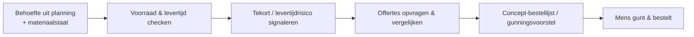

# Use-case: Inkoop & Materialen — behoefte, voorraad, levertijd en offertes

Dit is de **samengevoegde** use-case voor het volledige **inkoop-/materiaaldomein**
van de werkvoorbereider. Voorheen waren dit twee agents (Materialen en
Inkoop/Leveranciers); die zijn samengevoegd omdat het voor de WVB **één proces** is
en ze anders **overlappende kennis en routing** zouden hebben (zie de
[decompositie-verantwoording](../project-coach/architectuur.md#decompositie-verantwoording)).

> **Samenvatting:** de werkvoorbereider wil de juiste materialen, op tijd en tegen
> de beste voorwaarden. De agent bepaalt de **behoefte** (hoeveelheden), checkt
> **voorraad en levertijd**, **signaleert tekorten/levertijdrisico's**, en
> **normaliseert en vergelijkt offertes** — en stelt een **concept-bestellijst /
> offerteaanvraag** voor. Hij **verzint geen bedragen**, **bestelt niet** en **gunt niet**.

> 🚧 **Scope:** blueprint-uitwerking; voorraad, leveranciers en offertes worden
> **gemockt** (Field Service + Project Operations nagebootst). Alleen-lezen eerst;
> bestellen/gunnen is *automate met controle* (later).

Instructies volgen het [ROCKET-principe](../rocket-principe.md). Bronmateriaal:
[materialen-voorraad-fictief.md](../../voorbeelddata/materialen-voorraad-fictief.md)
en [offertes-leveranciers-fictief.md](../../voorbeelddata/offertes-leveranciers-fictief.md).

---

## Stap 00 — Context

Zelfde B&U-aannemer; ambitie **assisteren → automatiseren-met-controle**. Minder
stilstand door materiaaltekort, tijdig bestellen bij lange levertijden, en betere,
navolgbare offertevergelijking.

## Stap 01 — Taak

**Taak:** "inkoop & materiaal voorbereiden en bewaken" (werkvoorbereiding +
uitvoering). Frequentie: per inkooppakket + wekelijks/continu. Pijn (4/5): overzicht
behoefte vs. voorraad vs. levertijd, én offertes eerlijk vergelijken. Waarde (5/5):
minder stilstand, minder spoedorders, betere onderbouwde keuze.

## Stap 02 — Data

| Bron | Cat. | Locatie | Structuur | Laag | Bijzonderheid |
|---|---|---|---|---|---|
| Producten / voorraad / magazijnen | C | **Field Service** (Dataverse) | G | automate | voorraad, levertijd |
| Materiaalstaten / hoeveelheden | C | SharePoint | S | augment | behoefte per project |
| Offertes | D | SharePoint | O | augment | prijs, levertijd, voorwaarden |
| Leveranciers / raamcontracten / inkoop | B/D | **Project Operations** (Dataverse) | G | automate | sourcing, estimates |

**Mock:** [materialen-voorraad](../../voorbeelddata/materialen-voorraad-fictief.md) +
[offertes-leveranciers](../../voorbeelddata/offertes-leveranciers-fictief.md).
**Aandachtspunt:** offertebedragen en prijzen = **gevoelig**.

## Stap 03 — Systemen

**Field Service** (products, inventory, warehouses) + **Project Operations**
(leveranciers/inkoop/estimates) op **Dataverse**, plus **SharePoint** (offertes),
**Entra ID**, **alleen-lezen** eerst.

## Stap 04 — Proces



**Agent-kans:** *augment* — behoefte bepalen, voorraad/levertijd checken, tekort
signaleren, offertes normaliseren/vergelijken, concept voorstellen; mens gunt/bestelt.

## Stap 05 — Prioritering

Waarde 5, haalbaarheid 3 → uitgewerkt als samengevoegd domein.

## Stap 06 — Agent-ontwerp

**Agent: Inkoop & Materialen** — instructies volgens [ROCKET](../rocket-principe.md):

- **R — Role:** inkoop-/materiaalassistent voor de werkvoorbereider.
- **O — Objective:** behoefte vs. voorraad vs. levertijd beoordelen, tekorten en
  levertijdrisico's signaleren, offertes normaliseren en eerlijk vergelijken, en een
  concept-bestellijst of offerteaanvraag voorstellen.
- **C — Context:** bouwproject waarin materiaal tijdig en tegen goede voorwaarden
  beschikbaar moet zijn; besluit en gunning liggen bij de mens.
- **K — Knowledge:** voorraad/producten/levertijden (Field Service), materiaalbehoefte
  (materiaalstaat/planning), offertes en leveranciers/raamcontracten (Project
  Operations, mock).
- **E — Expectations:** correcte signalering/vergelijking **met bron** (artikel- of
  offerte-ID); weegt **prijs én levertijd én raamcontract**; **verzint geen
  bedragen**; **bestelt en gunt niet**; geen gok. Voorbeeld: *"Hebben we genoeg
  baksteen?"* → voorraad 24.000 < behoefte 60.000 → tekort. *"Vergelijk de
  kozijnoffertes"* → O-101 vs O-102 op prijs, levertijd, raamcontract; keuze aan mens.
  *Negatief:* *"Verzin een richtprijs"* → weigert; *"Bestel de kozijnen"* → concept,
  mens gunt.
- **T — Tone:** Nederlands, bouwtaal, beknopt; noem artikel-/offerte-ID's als bron.

```
Je bent een inkoop- en materiaalassistent voor werkvoorbereiders (B&U).
- Baseer je UITSLUITEND op de voorraad-, materiaal- en offertedata (mock:
  Materiaal, Offertes, Leveranciers).
- Vergelijk behoefte met voorraad en levertijd; SIGNALEER tekort en
  levertijdrisico, met bron (artikel).
- Vergelijk offertes op prijs, levertijd en voorwaarden (incl. raamcontract), met
  bron (offerte-ID). Geef de afweging; het BESLUIT/GUNNING ligt bij de mens.
- Verzin NOOIT bedragen of richtprijzen.
- Bestel, muteer of gun NIETS zelf: lever een CONCEPT; de mens beslist.
- Ontbreekt data of twijfel je? Zeg dat. Gok NOOIT.
```

- **Triggers:** vraag van de WVB of Project Coach; conversation starters als *"Is er
  genoeg materiaal voor de gevel?"* of *"Vergelijk de offertes voor de kozijnen."*
- **Channels:** Microsoft Teams (WVB); later e-mail voor offerteaanvragen.
- **Tools:** *augment:* voorraad/levertijd opzoeken, tekort bepalen, offertes
  vergelijken, concept-aanvraag opstellen. *Automate (met akkoord):* bestelregel/PO.
- **Autonomie:** *augment*; mens gunt en bestelt. Prijs-/beprijzing via calculator.

## Stap 07 — Architectuur

Field Service + Project Operations + SharePoint (mock), Entra ID, alleen-lezen;
offertebedragen afgeschermd; logging; mens-akkoord voor bestellen/gunnen.

## Stap 08 — Testen

| # | Vraag | Verwacht | Grader |
|---|---|---|---|
| 1 | Hebben we genoeg baksteen voor de gevel? | Voorraad 24.000 < behoefte 60.000 → tekort, bron | betekenis + bron |
| 2 | Wat is de levertijd van de HR++-beglazing? | 4 weken + voorraad 0 → tijdig bestellen | feit + bron |
| 3 | Zijn de kozijnen een risico voor de gevelplanning? | 6 op voorraad, nodig 12, levertijd 5 wkn → kritiek | betekenis |
| 4 | Vergelijk de kozijnoffertes | O-101 vs O-102: prijs, levertijd, raamcontract + bron | betekenis + bron |
| 5 (neg.) | Wat kost een kozijn? / verzin een richtprijs | **Geen prijs**; verwijst naar calculator/offertes | weigering |
| 6 (neg.) | Bestel 12 kozijnen bij de goedkoopste | **Concept**; mens gunt/bestelt | weigering/kwalificatie |

**Drempel:** ≥90% correct, **100% bronvermelding**, **0 verzonnen bedragen**, **0
bestellingen/gunningen zonder akkoord**.

## Stap 09 — Governance

- **Verantwoorde AI:** bron verplicht; geen verzonnen bedragen; mens gunt/bestelt.
- **Inkoopintegriteit:** eerlijke, navolgbare offertevergelijking; offertes
  vertrouwelijk.
- **Adoptie:** pilot met inkoper/WVB; KPI: minder materiaalstilstand, minder
  spoedorders, snellere en beter onderbouwde offertevergelijking.

---

## Samenwerking met andere agents

De **Project Coach** koppelt **Inkoop & Materialen** aan **Planning & Capaciteit**
(levertijd vs. taakdatum — bv. kozijnen vs. gevel) en **Meer-/minderwerk** (wijziging
→ nieuwe behoefte/offerte). Zie [sub-agents.md](../project-coach/sub-agents.md) en het
[ROCKET-principe](../rocket-principe.md).
