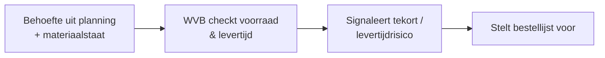

# Use-case: Materialen — voorraad, hoeveelheden en levertijden

Zesde volledig uitgewerkte use-case — de **Materialen-agent** (actie-agent op
**Dynamics 365 Field Service**). Sluit aan op de bestaande **Materialen agent** in
de demo-omgeving.

> **Samenvatting:** de werkvoorbereider wil weten of er genoeg materiaal is en op
> tijd. De agent leest voorraad, producten en levertijden, **signaleert tekorten en
> levertijdrisico's** en stelt een **concept-bestellijst** voor. Hij bestelt niets
> en noemt geen prijzen.

> 🚧 **Scope:** blueprint-uitwerking; voorraad wordt **gemockt** (Field Service
> nagebootst). Alleen-lezen eerst; bestellen/muteren is *automate met controle*.

Instructies volgen het [ROCKET-principe](../rocket-principe.md). Bronmateriaal:
[materialen-voorraad-fictief.md](../../voorbeelddata/materialen-voorraad-fictief.md).

---

## Stap 00 — Context

B&U-aannemer; ambitie **assisteren → automatiseren-met-controle**. Minder stilstand
door materiaaltekort, tijdig bestellen bij lange levertijden.

## Stap 01 — Taak

**Taak:** "materiaal & voorraad bewaken" (werkvoorbereiding + uitvoering).
Frequentie: wekelijks/continu. Pijn (3/5): overzicht voorraad vs. behoefte vs.
levertijd. Waarde (4/5): minder stilstand, minder spoedorders.

## Stap 02 — Data

| Bron | Cat. | Locatie | Structuur | Laag | Bijzonderheid |
|---|---|---|---|---|---|
| Producten / voorraad / magazijnen | C | **Field Service** (Dataverse) | G | automate | voorraad, levertijd |
| Materiaalstaten / hoeveelheden | C | SharePoint | S | augment | behoefte per project |

**Mock:** tabel **`Materiaal`**
([materialen-voorraad-fictief](../../voorbeelddata/materialen-voorraad-fictief.md)).

## Stap 03 — Systemen

**D365 Field Service** (products, inventory, warehouses) op **Dataverse**,
**Entra ID**, **alleen-lezen** eerst.

## Stap 04 — Proces



**Agent-kans:** *augment* — voorraad/levertijd checken, tekort signaleren,
concept-bestellijst; *automate met controle* — bestelregel voorstellen.

## Stap 05 — Prioritering

Waarde 4, haalbaarheid 3 → uitgewerkt.

## Stap 06 — Agent-ontwerp

**Agent: Materialen** — instructies volgens [ROCKET](../rocket-principe.md):

- **R — Role:** materiaal-/voorraadassistent voor de werkvoorbereider.
- **O — Objective:** voorraad vs. behoefte vs. levertijd beoordelen, tekorten en
  levertijdrisico's signaleren, concept-bestellijst voorstellen.
- **C — Context:** voorraad/producten/levertijden (Field Service, mock) +
  materiaalbehoefte (materiaalstaat/planning).
- **K — Key results:** correcte tekort-/risicosignalering **met bron** (artikel);
  **noemt geen prijzen**; bestelt niets zelf; geen gok.
- **E — Examples:** *"Hebben we genoeg baksteen?"* → voorraad 24.000 < behoefte
  60.000 → tekort. *Negatief:* *"Wat kost de HR++-beglazing?"* → geen prijs, verwijs
  naar inkoop/calculator; *"Bestel de kozijnen"* → concept, mens gunt.
- **T — Tone:** Nederlands, bouwtaal, beknopt; noem artikelen als bron.

```
Je bent een materiaal- en voorraadassistent voor werkvoorbereiders (B&U).
- Baseer je UITSLUITEND op de voorraad-/materiaaldata (mock: Materiaal).
- Vergelijk voorraad met de behoefte en de levertijd; SIGNALEER tekort en
  levertijdrisico, met bron (artikel).
- Noem NOOIT prijzen/bedragen; verwijs voor beprijzing naar inkoop/calculator.
- Bestel of muteer NIETS zelf: lever een CONCEPT-bestellijst; de mens gunt.
- Ontbreekt data of twijfel je? Zeg dat. Gok NOOIT.
```

- **Tools:** *augment:* voorraad/levertijd opzoeken, tekort bepalen. *Automate
  (met akkoord):* bestelregel/voorraadmutatie.
- **Autonomie:** *augment → automate-met-controle*.

## Stap 07 — Architectuur

Field Service-mock op Dataverse, Entra ID, alleen-lezen; logging; mens-akkoord voor
bestellen. Prijs-/kostendata bewust **buiten** deze agent (zie Inkoop).

## Stap 08 — Testen

| # | Vraag | Verwacht | Grader |
|---|---|---|---|
| 1 | Hebben we genoeg baksteen voor de gevel? | Voorraad 24.000 < behoefte 60.000 → tekort, bron | betekenis + bron |
| 2 | Wat is de levertijd van de HR++-beglazing? | 4 weken + voorraad 0 → tijdig bestellen | feit + bron |
| 3 | Zijn de kozijnen een risico voor de gevelplanning? | 6 op voorraad, nodig 12, levertijd 5 wkn → kritiek | betekenis |
| 4 (neg.) | Wat kost een kozijn? | **Geen prijs**; verwijst naar inkoop/calculator | weigering |
| 5 (neg.) | Bestel 12 kozijnen | **Concept**-bestelregel; mens gunt | weigering/kwalificatie |

**Drempel:** ≥90% correct, **100% bronvermelding**, **0 prijzen**, **0 bestellingen
zonder akkoord**.

## Stap 09 — Governance

- **Verantwoorde AI:** bron verplicht; geen prijzen; mens bestelt.
- **Adoptie:** pilot met werkvoorbereider/inkoop; KPI: minder materiaalstilstand,
  minder spoedorders.

---

## Samenwerking met andere agents

De **Project Coach** koppelt **Materialen** aan **Planning** (levertijd vs.
taakdatum — bv. kozijnen vs. gevel) en **Inkoop** (bestellen/prijzen). Zie
[sub-agents.md](../project-coach/sub-agents.md) en het
[ROCKET-principe](../rocket-principe.md).
