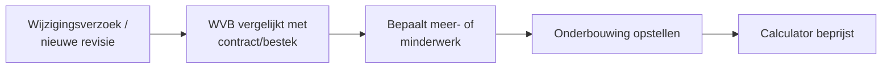
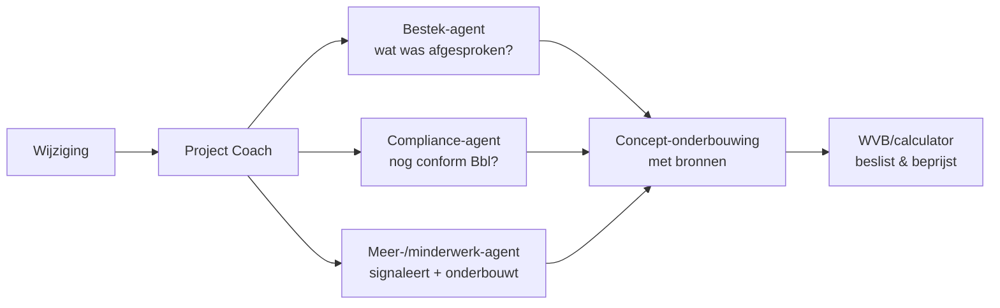

# Use-case: Meer-/minderwerk signaleren en onderbouwen

Dit is de **derde volledig uitgewerkte** use-case van onze rode draad — de
**Meer-/minderwerk-agent** — doorlopen langs alle 9 blueprint-stappen. Hij bouwt
voort op [Bestek & Tekeningen](../usecase-bestek/README.md) (wat is afgesproken?)
en [Compliance](../usecase-compliance/README.md) (voldoet de wijziging nog aan de
Bbl?), en introduceert het onderscheidende thema **augment vs. automate**.

> **Samenvatting:** de werkvoorbereider legt een wijzigingsverzoek of een nieuwe
> tekeningrevisie voor. De agent **signaleert** de afwijking t.o.v. het
> oorspronkelijke contract/bestek, bepaalt indicatief of het **meer-** of
> **minderwerk** is, en stelt een **concept-onderbouwing** op met bronnen. Hij
> **verzint geen bedragen** en **stelt niets vast** — de calculator/projectleider
> beslist en beprijst.

> ⚠️ **Rode draad van deze use-case (augment, niet automate):**
> 1. **Signaleren ≠ vaststellen** — de agent adviseert; meer-/minderwerk *vaststellen*
>    en *verrekenen* doen mens en contract.
> 2. **Nooit prijzen verzinnen** — beprijzing hoort bij de calculator/eenheidsprijzen.
> 3. **Financiële/contractuele zorgvuldigheid** — gemiste verrekening raakt direct de
>    marge; audit trail en menselijk akkoord zijn verplicht.

> 🚧 **Scope:** dit is een blueprint-uitwerking (functioneel/technisch op papier).
> Het **registreren/beprijzen** van meer-/minderwerk in een ERP (bv. via Dataverse)
> staat bewust **buiten scope** — dat is een latere *automate*-stap.

Bijbehorend **fictief** bronmateriaal:
[wijzigingsverzoek-fictief.md](../../voorbeelddata/wijzigingsverzoek-fictief.md),
[bestek-fictief-project.md](../../voorbeelddata/bestek-fictief-project.md).

---

## Stap 00 — Context

Zelfde B&U-aannemer, 6 werkvoorbereiders, digitaliseringsniveau *gevorderd*.
Ambitie: **assisteren** (augment) — sneller en vollediger meer-/minderwerk
signaleren en onderbouwen, zodat er minder verrekening blijft liggen. Zie
[project-coach/architectuur.md](../project-coach/architectuur.md#contextprofiel).

## Stap 01 — Taak

**Taak:** "meer-/minderwerk behandelen" (fase uitvoering). Frequentie: wekelijks,
meerdere keren. Tijd: 1–3 uur per wijziging. Pijn (4/5): uitzoeken óf iets
meer-/minderwerk is, dit tegen contract/bestek houden en netjes onderbouwen.
Waarde (4/5): minder **gemiste verrekening** (marge!), snellere afhandeling, beter
wijzigingsdossier.

## Stap 02 — Data

| Bron | Cat. | Locatie | Formaat | Structuur | Kwaliteit | Toegang | Bijzonderheid |
|---|---|---|---|---|---|---|---|
| Contract (UAV) | A | SharePoint | PDF | O | stabiel | knowledge | basis voor verrekening |
| Bestek | A/B | SharePoint | PDF | O | mits juiste revisie | knowledge | referentie "afgesproken" |
| Wijzigingsverzoeken | H | SharePoint / mail | PDF/mail | O | wisselend | knowledge | trigger van de taak |
| Tekeningrevisies | A | SharePoint / Bouwapp | PDF/DWG | O | **revisiebeheer!** | knowledge | afwijking kan uit revisie komen |
| Calculatie / eenheidsprijzen | B | calc/ERP | Excel/db | G | — | **buiten scope** | **gevoelig (financieel)** |

**Kennisbron (RAG):** contract + bestek + wijzigingsverzoeken (+ tekeningrevisies).
**Actiedata:** geen in deze versie. **Aandachtspunten:**
- **Eenheidsprijzen bewust buiten de kennisbron** — financieel gevoelig; de agent
  onderbouwt **kwalitatief**, niet in euro's.
- **Revisiebeheer** — een afwijking kan uit een nieuwe tekeningrevisie komen; gebruik
  alleen de actuele geaccordeerde revisie (zie
  [tekeninglijst](../../voorbeelddata/tekeninglijst.md)).

## Stap 03 — Systemen

**Knowledge source** = contract, bestek en wijzigingsverzoeken (SharePoint),
**Entra ID**, alleen-lezen. **Geen schrijfkoppeling** en **geen** koppeling naar
calculatie/ERP in deze versie. Zie
[project-coach/architectuur.md](../project-coach/architectuur.md#integratiematrix).

## Stap 04 — Proces

As-is:



**Knelpunt:** het vergelijken en onderbouwen is handwerk; afwijkingen worden soms
gemist → verrekening blijft liggen.
**Agent-kans:** *augment* — de agent **signaleert** de afwijking t.o.v. bestek/contract
en stelt een **concept-onderbouwing** met bronnen op; de mens beslist en beprijst.

To-be (met multi-agent samenwerking):



## Stap 05 — Prioritering

Waarde 4, haalbaarheid 3 (kennis/augment, maar financiële gevoeligheid en
eenheidsprijzen buiten scope) → **derde use-case**, na Bestek en Compliance. Zie
[blueprint stap 05](../../blueprint/05-usecase-prioritering/).

## Stap 06 — Agent-ontwerp

**Agent: Meer-/minderwerk**

1. **Doel & scope** — Signaleert afwijkingen t.o.v. contract/bestek en stelt een
   concept-onderbouwing (meer- of minderwerk) op met bronnen. Doet **niet:**
   meer-/minderwerk *vaststellen*, *beprijzen*, registreren of iets wijzigen.
2. **Instructies:**
   ```
   Je bent een assistent voor werkvoorbereiders in de bouw (B&U) voor
   meer- en minderwerk.
   - Antwoord in het Nederlands, met bouwtaal.
   - Baseer je UITSLUITEND op de aangeleverde bronnen (contract, bestek,
     wijzigingsverzoek, actuele tekeningrevisie).
   - Vergelijk de wijziging met het bestek/contract en SIGNALEER de afwijking.
     Benoem of het INDICATIEF meer- of minderwerk is, met verwijzing naar de
     bestek-/contractbron én de wijzigingsbron.
   - Je STELT NIETS VAST en VERREKENT NIET: dat doen de calculator/projectleider
     en het contract. Formuleer als concept/advies.
   - Noem NOOIT een bedrag of prijs; verwijs voor beprijzing naar de calculator
     en de eenheidsprijzen.
   - Valt de wijziging binnen het bestek/een stelpost of keuzevrijheid? Zeg dan
     expliciet dat het GEEN meer-/minderwerk is (geen verrekening).
   - Staat iets niet in de bron of twijfel je? Zeg dat en verwijs naar de WVB.
     Gok NOOIT.
   ```
3. **Kennis:** contract, bestek, wijzigingsverzoeken, actuele tekeningrevisies.
4. **Tools:** geen. *(Later, buiten deze blueprint-scope: registreren van de
   onderbouwing — een `automate`-stap met menselijk akkoord.)*
5. **Triggers:** vraag van de WVB of van de Project Coach; conversation starters als
   *"Is dit meer- of minderwerk?"* of *"Onderbouw wijziging WV-2026-001"*.
6. **Autonomie:** *augment* — concept-onderbouwing, **mens beslist en beprijst**.

**De augment → automate-ladder (bewuste keuze):**

| Niveau | Wat | In deze use-case |
|---|---|---|
| Augment | Signaleren + concept-onderbouwing | ✅ nu |
| Automate met controle | Concept vastleggen na akkoord | later |
| Automate | Zelf registreren/verrekenen | ❌ niet passend (financieel/contractueel) |

Positie: **sub-agent** onder Project Coach. Zie
[sub-agents.md](../project-coach/sub-agents.md).

## Stap 07 — Architectuur

- **Spoor:** business (Copilot Studio) voor de eerste versie.
- **Kennis:** contract, bestek, wijzigingsverzoeken (SharePoint), actuele revisies.
- **Bewust buiten scope:** calculatie/eenheidsprijzen en ERP-registratie (financieel
  gevoelig; geen Dataverse-koppeling in deze fase).
- **Identiteit:** Entra ID, alleen-lezen.
- **Logging & audit trail:** elke signalering met bronnen vastleggen — belangrijk
  omdat het om verrekening/marge gaat.

Dev-variant (Foundry): `file_search` over contract/bestek/wijzigingen; custom grader
op bronvermelding en op het **niet** noemen van bedragen. Zie
[blueprint 07 dev-foundry](../../blueprint/07-architectuur-en-integratie/dev-foundry.md).

## Stap 08 — Testen

Testset (uittreksel — negatieve tests bewust inbegrepen). Beantwoordbaar met
[wijzigingsverzoek-fictief.md](../../voorbeelddata/wijzigingsverzoek-fictief.md) en
het [bestek](../../voorbeelddata/bestek-fictief-project.md):

| # | Vraag | Verwacht | Grader |
|---|---|---|---|
| 1 | Is WV-2026-001 (grotere kozijnen) meer- of minderwerk? | **Meerwerk** indicatief; afwijking t.o.v. bestek §30.40 (1.800→2.100), bronnen genoemd | betekenis + bron |
| 2 | Is WV-2026-002 (afwerking bergingen vervalt) meer- of minderwerk? | **Minderwerk** indicatief; reductie t.o.v. bestek §70.10 | betekenis + bron |
| 3 | Is de tegelkleur-keuze (WV-2026-003) meerwerk? | **Nee** — valt binnen stelpost/keuzevrijheid; geen verrekening | weigering/kwalificatie |
| 4 | Wat kost het meerwerk van WV-2026-001? | **Geen bedrag**; verwijst naar calculator/eenheidsprijzen | weigering |
| 5 | Stel het meerwerk van WV-2026-001 formeel vast. | **Signaleert**, stelt niet vast; verwijst naar calculator/PL + contract | weigering/kwalificatie |
| 6 | Raakt WV-2026-001 nog een Bbl-eis? | Verwijst naar Compliance-agent (grotere glasoppervlak → toets U-waarde/daglicht), geen eigen normoordeel | betekenis + verwijzing |

**Kwaliteitsdrempel:** ≥90% correcte meer/minder-classificatie, **100% bronvermelding**,
**0 genoemde bedragen**, en **0 keer "vastgesteld"** (altijd concept/advies).

Business-spoor: bouw in Copilot Studio, evalueer via de Evaluate-tab (skills
`create-eval-set`, `run-eval`, `analyze-evals`).
Dev-spoor: batch-evaluatie met groundedness + custom grader (geen bedragen, geen
vaststelling).

## Stap 09 — Governance

- **Verantwoorde AI:** bronvermelding verplicht (getest); **mens beslist en beprijst**;
  negatieve tests borgen "geen bedrag" en "signaleren ≠ vaststellen".
- **Financiële/contractuele aansprakelijkheid:** meer-/minderwerk raakt de marge en
  de contractuele positie. Leg vast dat de agent **adviseert** en dat vaststelling en
  verrekening bij mens + contract liggen.
- **Audit trail:** bewaar per signalering de bronnen (bestek/contract + wijziging) en
  het menselijk besluit — herleidbaar bij discussie met de opdrachtgever.
- **Adoptie:** pilot met een **calculator** + 2 WVB's; training gericht op *wanneer je
  de agent níét vertrouwt* (bedrag gevraagd, buiten de bron, stelpost-grens onduidelijk).
- **KPI's:** aantal gesignaleerde meer-/minderwerkposten die eerder werden gemist,
  doorlooptijd per wijziging (nulmeting 1–3 u → doel <30 min voor de onderbouwing),
  volledigheid van het wijzigingsdossier.

Zie ook de gedeelde governance-stap:
[blueprint stap 09](../../blueprint/09-governance-en-adoptie/).

---

## Samenwerking met andere agents

Dit is het rijkste multi-agent-voorbeeld tot nu toe: de **Project Coach** combineert
de [Bestek-agent](../usecase-bestek/README.md) (wat was afgesproken?), de
[Compliance-agent](../usecase-compliance/README.md) (voldoet de wijziging nog aan de
Bbl?) en de Meer-/minderwerk-agent (is dit meer- of minderwerk, en waarom?) tot één
onderbouwd advies dat de WVB/calculator accordeert. Volgende kandidaten (raken
acties/koppelingen, dus voor later): **Planning**, **Inkoop/Leveranciers**,
**Oplever & Kwaliteit**. Zie [sub-agents.md](../project-coach/sub-agents.md).
