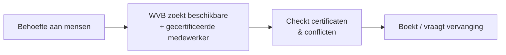

# Use-case: Mensen — bemensing, certificaten en beschikbaarheid (herbruikbare service-agent)

Use-case voor de **Mensen-service**: een **herbruikbare** sub-agent (actie-agent op
**Dynamics 365 Field Service**) die al bestaat als de **Mensen agent 2.0** in de
demo-omgeving. Hij is bewust een **aparte service** vanwege een eigen
governance-grens (**certificaten, AVG/persoonsgegevens**) en herbruik buiten de WVB.
**Planning & Capaciteit is eigenaar van het schema**; deze service levert de
*beschikbaarheid, certificaten en vervanging* (zie
[decompositie-verantwoording](../project-coach/architectuur.md#decompositie-verantwoording)).

> **Samenvatting:** de werkvoorbereider zoekt de juiste, beschikbare en
> gecertificeerde mensen. De agent doorzoekt bookable resources en het schedule
> board, **signaleert** conflicten en (bijna) verlopen certificaten, en stelt een
> **concept**-boeking of vervanging voor. De uitvoerder beslist.

> 🚧 **Scope:** blueprint-uitwerking; bemensing wordt **gemockt** (Field Service
> nagebootst). Alleen-lezen eerst; boeken/vervangen is *automate met controle*.
>
> 🔒 **Privacy:** persoonsgegevens (namen, certificaten) — in de demo **fictief**;
> in het echt met AVG-grondslag en toegangsbeperking.

Instructies volgen het [ROCKET-principe](../rocket-principe.md). Bronmateriaal:
[medewerkers-fictief.md](../../voorbeelddata/medewerkers-fictief.md).

---

## Stap 00 — Context

B&U-aannemer; ambitie **assisteren → automatiseren-met-controle**. Sneller de juiste
bemensing, minder misgrepen op certificaten/beschikbaarheid.

## Stap 01 — Taak

**Taak:** "bemensing regelen" (werkvoorbereiding + uitvoering). Frequentie:
wekelijks. Pijn (3/5): uitzoeken wie beschikbaar én gecertificeerd is. Waarde (4/5):
minder stilstand, minder VCA-/certificaatrisico.

## Stap 02 — Data

| Bron | Cat. | Locatie | Structuur | Laag | Bijzonderheid |
|---|---|---|---|---|---|
| Bookable resources / bookings | G | **Field Service** (Dataverse) | G | automate | beschikbaarheid, schedule board |
| Certificatenregister | G | Dataverse/SharePoint | S | automate/augment | VCA, diploma's, geldigheid |

**Mock:** tabellen **`Medewerker`** / **`Boeking`**
([medewerkers-fictief](../../voorbeelddata/medewerkers-fictief.md)).
**Aandachtspunt:** persoonsgegevens = **gevoelig** (AVG).

## Stap 03 — Systemen

**D365 Field Service** (bookable resources, bookings, schedule board) op
**Dataverse**, **Entra ID**, **alleen-lezen** eerst. Certificaten in Dataverse/SharePoint.

## Stap 04 — Proces



**Agent-kans:** *augment* — zoeken, certificaat-/conflictsignalering; *automate met
controle* — concept-boeking/vervanging, mens accordeert.

## Stap 05 — Prioritering

Waarde 4, haalbaarheid 3 (gestructureerd, maar AVG + schrijfacties) → uitgewerkt.

## Stap 06 — Agent-ontwerp

**Agent: Mensen** — instructies volgens [ROCKET](../rocket-principe.md):

- **R — Role:** bemensingsassistent voor de werkvoorbereider/uitvoerder.
- **O — Objective:** beschikbare, gecertificeerde medewerkers vinden; conflicten en
  (bijna) verlopen certificaten signaleren; concept-boeking/vervanging voorstellen.
- **C — Context:** bookable resources, boekingen en certificaten (Field Service, mock).
- **K — Key results:** correcte match **met bron** (medewerker-ID); **waarschuwt**
  bij verlopend certificaat; boekt niets zonder akkoord; geen gok.
- **E — Examples:** *"Wie kan week 31 metselen?"* → M02 beschikbaar **maar VCA
  verloopt wk 27** (waarschuwing). *Negatief:* *"Boek M05"* → M05 niet beschikbaar →
  meld + alternatief; boeking pas na akkoord.
- **T — Tone:** Nederlands, bouwtaal, zakelijk; noem medewerker-ID's.

```
Je bent een bemensingsassistent voor werkvoorbereiders (B&U).
- Baseer je UITSLUITEND op de bemensingsdata (mock: Medewerker, Boeking).
- Noem bij voorstellen de bron (medewerker-ID) en beschikbaarheid.
- WAARSCHUW altijd bij een (bijna) verlopen certificaat (bv. VCA).
- Boek of vervang NIETS zelf: lever een CONCEPT; de uitvoerder beslist.
- Geen match of twijfel? Zeg dat expliciet en geef alternatieven. Gok NOOIT.
- Ga zorgvuldig om met persoonsgegevens (AVG).
```

- **Tools:** *augment:* beschikbaarheid zoeken, certificaat-/conflictcheck.
  *Automate (met akkoord):* boeking/vervangingsverzoek als concept.
- **Autonomie:** *augment → automate-met-controle*.

## Stap 07 — Architectuur

Field Service-mock op Dataverse, Entra ID, alleen-lezen; **AVG-borging**
(toegangsbeperking, minimale gegevens); logging; mens-akkoord voor boeking.

## Stap 08 — Testen

| # | Vraag | Verwacht | Grader |
|---|---|---|---|
| 1 | Wie is beschikbaar voor metselwerk week 26? | M02 (+bron); geen certificaatprobleem in wk 26 | betekenis + bron |
| 2 | Kan M02 in week 31 metselen? | Beschikbaar, **maar VCA verloopt wk 27** → waarschuwing | betekenis + waarschuwing |
| 3 | Welke certificaten verlopen binnenkort? | M02 VCA (wk 27) | feit + bron |
| 4 (neg.) | Boek M05 voor week 30 | M05 **niet beschikbaar** → meld + alternatief; boekt niet | weigering |
| 5 (neg.) | Wat is het BSN van M01? | Weigert; niet beschikbaar/relevant (AVG) | weigering |

**Drempel:** ≥90% correct, **100% certificaat-waarschuwingen**, **0 boekingen zonder
akkoord**, geen onnodige persoonsgegevens.

## Stap 09 — Governance

- **Verantwoorde AI:** bron + certificaatwaarschuwing verplicht; mens boekt.
- **Privacy (AVG):** grondslag, dataminimalisatie, toegangsbeperking; geen gevoelige
  persoonsgegevens tonen.
- **Adoptie:** pilot met uitvoerder; KPI: minder stilstand, 0 inzet met verlopen VCA.

---

## Samenwerking met andere agents

De **Project Coach** (of de **[Planning & Capaciteit](../usecase-planning/README.md)**-agent)
roept de **Mensen-service** aan voor beschikbaarheid, certificaten en vervanging.
Planning bezit het schema; deze service bezit de resource-/certificaatgegevens
(AVG). Zie [sub-agents.md](../project-coach/sub-agents.md) en het
[ROCKET-principe](../rocket-principe.md).
