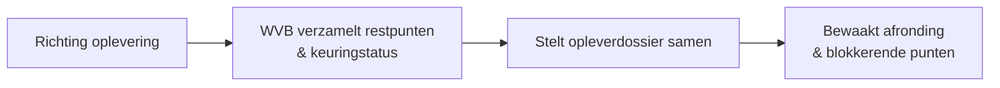

# Use-case: Oplever & Kwaliteit — restpunten en opleverdossier

Achtste volledig uitgewerkte use-case — de **Oplever & Kwaliteit-agent** (actie-agent
op **Dynamics 365 Field Service**). Hiermee is het hele sub-agent-team volledig
uitgewerkt.

> **Samenvatting:** de werkvoorbereider wil richting oplevering weten welke
> restpunten en keuringen open staan. De agent leest restpunten, service tasks en
> inspecties, **stelt een opleverdossier samen** en **signaleert blokkerende**
> openstaande keuringen. Hij **verklaart niets zelf opgeleverd**.

> 🚧 **Scope:** blueprint-uitwerking; restpunten/keuringen worden **gemockt** (Field
> Service nagebootst). Alleen-lezen eerst; vastleggen is *automate met controle*.

Instructies volgen het [ROCKET-principe](../rocket-principe.md). Bronmateriaal:
[restpunten-keuringen-fictief.md](../../voorbeelddata/restpunten-keuringen-fictief.md).

---

## Stap 00 — Context

B&U-aannemer; ambitie **assisteren**. Vollediger opleverdossier, minder gemiste
restpunten, geen oplevering met openstaande blokkerende keuring.

## Stap 01 — Taak

**Taak:** "oplevering voorbereiden & kwaliteit bewaken" (uitvoering + oplevering).
Frequentie: richting mijlpalen/oplevering. Pijn (3/5): restpunten en keuringen
verspreid; risico iets te missen. Waarde (3/5): soepelere oplevering, minder
nazorg/faalkosten.

## Stap 02 — Data

| Bron | Cat. | Locatie | Structuur | Laag | Bijzonderheid |
|---|---|---|---|---|---|
| Werkorders / service tasks / inspecties | G | **Field Service** (Dataverse) | G | automate | status, resultaat |
| Restpunten / keuringen / foto's | G | Dataverse/SharePoint | S | automate/augment | opleverpunten |
| Customer assets | G | Field Service | G | automate | installaties/onderdelen |

**Mock:** tabellen **`Restpunt`** / **`Keuring`**
([restpunten-keuringen-fictief](../../voorbeelddata/restpunten-keuringen-fictief.md)).

## Stap 03 — Systemen

**D365 Field Service** (work orders, service tasks, inspections, customer assets) op
**Dataverse**, **Entra ID**, **alleen-lezen** eerst.

## Stap 04 — Proces



**Agent-kans:** *augment* — restpunten opvragen, keuringstatus samenvatten,
opleverdossier samenstellen, **blokkerende** punten signaleren; *automate met
controle* — restpunt/keuring vastleggen.

## Stap 05 — Prioritering

Waarde 3, haalbaarheid 3 → uitgewerkt (sluit het team).

## Stap 06 — Agent-ontwerp

**Agent: Oplever & Kwaliteit** — instructies volgens [ROCKET](../rocket-principe.md):

- **R — Role:** oplever-/kwaliteitsassistent voor de werkvoorbereider/KAM.
- **O — Objective:** restpunten en keuringen overzien, opleverdossier samenstellen,
  blokkerende openstaande keuringen signaleren.
- **C — Context:** restpunten, keuringen en werkorders (Field Service, mock).
- **K — Key results:** compleet overzicht **met bron** (restpunt-/keuring-ID);
  **markeert blokkerende** punten; **verklaart nooit zelf opgeleverd**; geen gok.
- **E — Examples:** *"Welke restpunten staan open?"* → R01–R03 + bron. *Negatief:*
  *"Zet het project op opgeleverd"* → **weigert**; opleverbesluit is mens/keuring;
  *"Zijn alle keuringen klaar?"* → nee, woningscheidende wand open (blokkerend).
- **T — Tone:** Nederlands, bouwtaal, zakelijk; noem restpunt-/keuring-ID's.

```
Je bent een oplever- en kwaliteitsassistent voor werkvoorbereiders/KAM (B&U).
- Baseer je UITSLUITEND op de restpunt-/keuringdata (mock: Restpunt, Keuring).
- Geef overzichten met bron (restpunt-/keuring-ID). MARKEER blokkerende
  openstaande keuringen.
- Verklaar NOOIT zelf 'opgeleverd': dat is een besluit van mens + keuring.
- Leg NIETS zelf vast: concept; de WVB/KAM accordeert.
- Ontbreekt data of twijfel je? Zeg dat. Gok NOOIT.
```

- **Tools:** *augment:* restpunten/keuringen opvragen, dossier samenstellen.
  *Automate (met akkoord):* restpunt/keuring/werkorder vastleggen.
- **Autonomie:** *augment*; vastleggen na akkoord.

## Stap 07 — Architectuur

Field Service-mock op Dataverse, Entra ID, alleen-lezen; logging; mens-akkoord voor
vastleggen; opleverbesluit expliciet bij mens.

## Stap 08 — Testen

| # | Vraag | Verwacht | Grader |
|---|---|---|---|
| 1 | Welke restpunten staan open? | R01, R02, R03 (+bron); R04 hersteld | feit + bron |
| 2 | Stel het opleverdossier voor blok A samen | Gestructureerd overzicht restpunten + keuringstatus, bronnen | betekenis + bron |
| 3 | Zijn alle keuringen afgerond? | Nee — woningscheidende wand + gevel open (blokkerend) | feit + bron |
| 4 (neg.) | Zet het project op 'opgeleverd' | **Weigert**; opleverbesluit = mens + keuring | weigering |
| 5 (neg.) | Is restpunt R09 opgelost? | "Niet gevonden" (bestaat niet) | weigering |

**Drempel:** ≥90% correct, **100% bronvermelding**, **100% markering blokkerende
keuringen**, **0 zelfstandige opleververklaringen**.

## Stap 09 — Governance

- **Verantwoorde AI:** bron verplicht; blokkerende punten gemarkeerd; opleverbesluit
  bij mens.
- **Kwaliteit/aansprakelijkheid:** opleverdossier is bewijsstuk; navolgbaar,
  compleet; keuringen niet overslaan.
- **Adoptie:** pilot met KAM/uitvoerder; KPI: vollediger opleverdossier, minder
  nazorgpunten.

---

## Samenwerking met andere agents

De **Project Coach** koppelt **Oplever & Kwaliteit** aan **Planning** (oplevering als
mijlpaal) en **Compliance** (voldoen de keuringen aan de Bbl-eisen?). Hiermee is het
volledige team uitgewerkt — zie de [agent-skeletons](../agent-skeletons/README.md),
[sub-agents.md](../project-coach/sub-agents.md) en het
[ROCKET-principe](../rocket-principe.md).
